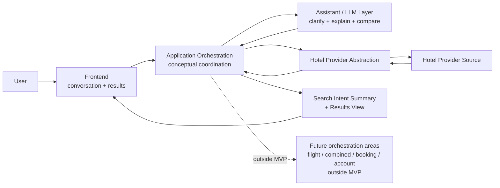

# Stage 5.4 — Application Orchestration

## Purpose

This document describes conceptual application orchestration for Travel Assistant MVP v1.

Application orchestration coordinates user intent, assistant/LLM support, hotel provider abstraction, results view and domain boundaries. Its purpose is to keep the hotel-only MVP coherent across conversation, Search Intent Summary, hotel retrieval, explanations, comparisons and current-session shortlist.

This document does not define production implementation, API contracts, classes, interfaces, state machine code, queues, events, deployment topology or database model.

## Orchestration Scope for MVP v1

MVP v1 orchestration covers:

- user request intake;
- clarification of hotel search intent;
- Search Intent Summary formation and update;
- hotel-only provider retrieval through abstraction;
- separation of provider facts, user constraints, assistant assumptions and unknown data;
- explanation and comparison of hotel offers;
- coordination between assistant conversation and results view;
- current-session shortlist handling as confirmed by Stage 3/4.

MVP v1 orchestration explicitly excludes:

- flight orchestration;
- combined itinerary orchestration;
- booking/payment flow;
- account history;
- full auth;
- production provider workflow;
- support/admin workflows.

## Application Layer Responsibilities

At conceptual level, the application layer is responsible for:

- preserving MVP scope;
- coordinating assistant and provider abstraction;
- enforcing domain rules from Stage 5.3;
- keeping Search Intent Summary aligned with user input and clarifications;
- preventing assistant assumptions from becoming provider facts;
- exposing unknown data instead of fabricating it;
- deciding when results view can be shown conceptually;
- maintaining current-session UI/application state at conceptual level.

These responsibilities do not imply concrete services, classes, modules, package names or implementation structure.

## Conceptual Orchestration Flow

At a high level:

1. User provides an initial travel request.
2. Assistant/application identifies missing decision-critical constraints.
3. Assistant asks clarification only when needed.
4. Application forms or updates Search Intent Summary.
5. Application requests hotel offers through provider abstraction.
6. Provider returns available hotel facts or missing data.
7. Application preserves provider facts separately from assumptions and unknowns.
8. Assistant explains and compares hotel options.
9. Frontend presents conversation, Search Intent Summary and Results View.
10. User may refine constraints or shortlist options within the current session.

This is a conceptual flow, not a sequence diagram, endpoint design, request/response payload design, retry strategy, caching strategy or database write plan.

## Orchestration States / Phases

The following are conceptual phases, not implementation states. They are not a state machine specification and do not define transitions, guards, events or state IDs.

### Intent capture

**Purpose:** Understand whether the user is asking for a supported hotel-related flow, a clarification-first open destination flow or an unsupported/future-scope action.

**Input concept:** User Request.

**Output concept:** Initial Search Intent Summary direction or a future-scope/unsupported response.

**Key boundaries:** MVP v1 supports hotel-only intent. Flight, combined, booking and payment requests receive safe boundary communication.

**What must not happen:** The system must not start flight/combined retrieval, imply booking/payment capability or silently treat broad trip planning as full itinerary orchestration.

### Clarification

**Purpose:** Ask only for decision-critical missing information before hotel retrieval.

**Input concept:** User Request, User-provided Constraints, missing required constraints, assistant assumptions.

**Output concept:** Updated user constraints, confirmed or visible assumptions, unresolved unknowns.

**Key boundaries:** Clarification should stay focused and avoid turning the product into a long form. User corrections override assistant assumptions.

**What must not happen:** The assistant must not fabricate missing user constraints, hide material ambiguity or launch provider retrieval when required constraints are missing.

### Intent summary

**Purpose:** Maintain a human-readable bridge between conversation and results.

**Input concept:** User-provided Constraints, assistant clarifications, visible assumptions, unknown data.

**Output concept:** Search Intent Summary.

**Key boundaries:** Summary must remain traceable to user input and assistant clarifications.

**What must not happen:** Summary must not present assumptions as user-confirmed constraints or provider-verified facts.

### Hotel retrieval

**Purpose:** Retrieve hotel-only offers through provider abstraction when the search is sufficiently understood.

**Input concept:** Hotel Search Intent and Search Intent Summary.

**Output concept:** Hotel Offers, available Provider Facts, missing provider data or provider unavailability signal at conceptual level.

**Key boundaries:** Provider/source data owns hotel facts. Provider abstraction hides concrete provider details.

**What must not happen:** The application must not call flight, booking or payment providers as part of MVP v1, and must not convert provider limitations into invented facts.

### Results explanation

**Purpose:** Help the user understand why offers match, where trade-offs exist and what remains uncertain.

**Input concept:** Hotel Offers, Provider Facts, User-provided Constraints, Assistant Assumptions, Unknown Data.

**Output concept:** Assistant explanation, rationale, caveats and Results View support.

**Key boundaries:** Explanation can reason about trade-offs but must preserve facts/assumptions/unknowns separation.

**What must not happen:** Explanation must not imply price guarantee, availability guarantee, booking completion or factual attributes not returned by provider/source data.

### Comparison/refinement

**Purpose:** Support comparing hotel offers and updating constraints based on user feedback.

**Input concept:** Selected Hotel Offers, User-provided Constraints, Provider Facts, Unknown Data, user refinement.

**Output concept:** Hotel Comparison, updated Search Intent Summary, stale or refreshed conceptual results when relevant.

**Key boundaries:** User corrections override assumptions. Provider facts remain source-owned.

**What must not happen:** The system must not silently rerank against changed hard constraints or hide that previous results may be stale.

### Current-session shortlist

**Purpose:** Let the user temporarily save useful hotel offers or comparison candidates within the active search session.

**Input concept:** Selected Hotel Offer or comparison set, current Search Intent Summary, provider facts, assumptions and unknowns.

**Output concept:** Current-session Shortlist.

**Key boundaries:** Shortlist is a session-level selection aid only.

**What must not happen:** Shortlist must not imply account history, persistent saved trips, booking, full auth, cross-device sync or guaranteed fresh price/availability.

## Assistant / LLM Boundary

The LLM may:

- clarify;
- summarize;
- explain;
- compare;
- reason about trade-offs;
- communicate uncertainty;
- ask follow-up questions.

The LLM must not:

- fabricate provider facts;
- silently override user constraints;
- convert assumptions into hotel attributes;
- imply booking/payment/flight capabilities in MVP;
- hide unknown data when decision-critical.

LLM output supports orchestration and user understanding. It does not own provider facts, final decisions or MVP scope.

## Provider Abstraction Boundary

The provider abstraction is the conceptual source boundary for hotel facts.

It:

- provides hotel facts through an abstracted source boundary;
- hides concrete provider details from application/domain concepts;
- supports future replacement or integration without changing product scope;
- remains hotel-only in MVP v1.

It does not include flight providers, booking providers or payment providers in MVP. This document does not create provider interfaces, provider method names, API contracts or concrete provider choices.

## Frontend / Results Coordination Boundary

Orchestration supports the UX by keeping the experience chat-first, not chat-only.

The assistant conversation remains the primary guidance surface for clarification, explanation and refinement. The results view provides structured hotel comparison through Search Intent Summary, Hotel Offer Cards, details, comparison and current-session shortlist.

Search Intent Summary bridges conversation and results. Hotel Offer Cards must not hide uncertainty, freshness limitations or unknown data when these affect user decisions. User refinements should update the intent conceptually and make changed or stale context visible.

This section does not design UI components, layouts, props or frontend implementation details.

## Handling Refinements and Corrections

Conceptual rules:

- user corrections override assistant assumptions;
- user refinements may update Search Intent Summary;
- provider facts remain source-owned;
- stale assumptions should be discarded or relabeled;
- changes may require fresh hotel retrieval conceptually.

Refinement can change dates, destination, guests, rooms, budget, location preferences, amenities, hard constraints or priority trade-offs. The system should preserve clarity about what changed and what previous results may no longer satisfy.

This section does not define algorithms, caching, invalidation or event handling.

## Failure / Uncertainty Handling at Orchestration Level

### Missing user constraints

The assistant should ask focused clarification before hotel retrieval when decision-critical constraints are missing.

### Missing provider data

The system may still show useful hotel offers when critical facts are available, but missing fields must remain unknown and should affect explanation confidence.

### Provider unavailable

Provider unavailability should be presented as a source problem, not as proof that no hotels exist.

### Conflicting constraints

The assistant should surface the conflict and ask which constraint matters most or whether the user wants to relax one.

### Too many results

The assistant may ask for priorities or summarize trade-offs. It must not invent hidden ranking facts to force a recommendation.

### No useful hotel matches

No useful matches should be separated from provider error and paired with concept-level relaxation options such as broader area, flexible dates, changed budget or fewer hard constraints.

### Low-confidence assistant interpretation

The assistant should label uncertainty, ask a follow-up question or show the assumption rather than silently treating the interpretation as fact.

This section does not define error codes, retry policy, observability implementation or support workflow.

## Current-session Shortlist Boundary

Stage 3/4 confirm save/shortlist within the current search session.

Current-session Shortlist is:

- a temporary session-level selection aid;
- scoped to hotel offers and comparison candidates;
- connected to current user constraints, provider facts, assumptions and unknowns.

It is not:

- account history;
- persistent saved trips;
- full-auth feature;
- booking;
- payment;
- cross-device sync.

Freshness of shortlisted offers must not be guaranteed unless provider/source data confirms it.

## Mermaid Diagram

The diagram is conceptual. It does not show endpoints, tables, classes, queues, modules, payloads or deployment topology.

## Future Expansion Orchestration Boundaries

Flights would require a separate orchestration area.

Combined itinerary would require multi-domain composition across separately established hotel and flight flows.

Booking/payment would require transactional orchestration, compliance and reliability decisions.

Account history/full auth would require identity and persistence scope.

None of these are part of MVP v1 orchestration.

## Open Questions

- What minimum completeness is needed before hotel retrieval for broad or open destination requests?
- Should Search Intent Summary be editable directly, only confirmable, or corrected through conversation in MVP?
- What provider unavailability behavior is acceptable for MVP without overengineering retry/support workflows?
- How much uncertainty should be shown in Results View before it becomes overwhelming?
- Does current-session shortlist need persistence across browser refresh within MVP, or only active-session memory?

These questions are architecture-level inputs, not implementation tasks.

## Non-goals

This document does not define:

- state machine implementation;
- API contracts;
- DTOs/classes/interfaces;
- database schema;
- queues/events;
- retry/caching policy;
- deployment topology;
- production integrations;
- implementation backlog.

It also does not start Stage 5.5 or Stage 6.
