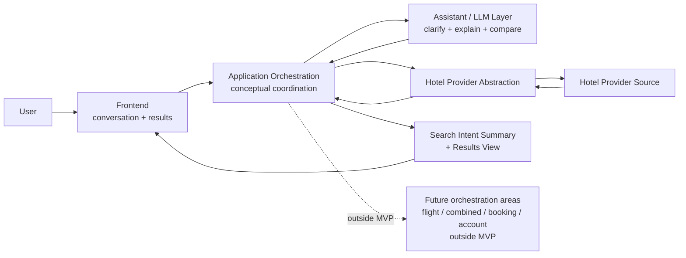

# Stage 5.4 — Application Orchestration

## Назначение

Этот документ описывает conceptual application orchestration для Travel Assistant MVP v1.

Application orchestration координирует user intent, assistant/LLM support, hotel provider abstraction, results view и domain boundaries. Ее цель — сохранять hotel-only MVP coherent across conversation, Search Intent Summary, hotel retrieval, explanations, comparisons и current-session shortlist.

Этот документ не определяет production implementation, API contracts, classes, interfaces, state machine code, queues, events, deployment topology или database model.

## Orchestration scope для MVP v1

Orchestration MVP v1 покрывает:

- user request intake;
- clarification of hotel search intent;
- Search Intent Summary formation and update;
- hotel-only provider retrieval through abstraction;
- separation of provider facts, user constraints, assistant assumptions and unknown data;
- explanation and comparison of hotel offers;
- coordination between assistant conversation and results view;
- current-session shortlist handling, как подтверждено Stage 3/4.

Orchestration MVP v1 явно исключает:

- flight orchestration;
- combined itinerary orchestration;
- booking/payment flow;
- account history;
- full auth;
- production provider workflow;
- support/admin workflows.

## Application layer responsibilities

На conceptual level application layer отвечает за:

- preserving MVP scope;
- coordinating assistant and provider abstraction;
- enforcing domain rules from Stage 5.3;
- keeping Search Intent Summary aligned with user input and clarifications;
- preventing assistant assumptions from becoming provider facts;
- exposing unknown data instead of fabricating it;
- deciding when results view can be shown conceptually;
- maintaining current-session UI/application state at conceptual level.

Эти responsibilities не подразумевают concrete services, classes, modules, package names или implementation structure.

## Conceptual orchestration flow

На high level:

1. User provides an initial travel request.
2. Assistant/application identifies missing decision-critical constraints.
3. Assistant asks clarification only when needed.
4. Application forms or updates Search Intent Summary.
5. Application requests hotel offers through provider abstraction.
6. Provider returns available hotel facts or missing data.
7. Application preserves provider facts separately from assumptions and unknowns.
8. Assistant explains and compares hotel options.
9. Frontend presents conversation, Search Intent Summary and Results View.
10. User may refine constraints or shortlist options within the current session.

Это conceptual flow, а не sequence diagram, endpoint design, request/response payload design, retry strategy, caching strategy или database write plan.

## Orchestration states / phases

Следующее является conceptual phases, а не implementation states. Это не state machine specification и не определяет transitions, guards, events или state IDs.

### Intent capture

**Purpose:** Понять, запрашивает ли user supported hotel-related flow, clarification-first open destination flow или unsupported/future-scope action.

**Input concept:** User Request.

**Output concept:** Initial Search Intent Summary direction или future-scope/unsupported response.

**Key boundaries:** MVP v1 supports hotel-only intent. Flight, combined, booking и payment requests получают safe boundary communication.

**What must not happen:** System не должен start flight/combined retrieval, imply booking/payment capability или silently treat broad trip planning as full itinerary orchestration.

### Clarification

**Purpose:** Задавать вопросы только о decision-critical missing information before hotel retrieval.

**Input concept:** User Request, User-provided Constraints, missing required constraints, assistant assumptions.

**Output concept:** Updated user constraints, confirmed or visible assumptions, unresolved unknowns.

**Key boundaries:** Clarification should stay focused and avoid turning the product into a long form. User corrections override assistant assumptions.

**What must not happen:** Assistant не должен fabricate missing user constraints, hide material ambiguity или launch provider retrieval when required constraints are missing.

### Intent summary

**Purpose:** Поддерживать human-readable bridge between conversation and results.

**Input concept:** User-provided Constraints, assistant clarifications, visible assumptions, unknown data.

**Output concept:** Search Intent Summary.

**Key boundaries:** Summary must remain traceable to user input and assistant clarifications.

**What must not happen:** Summary must not present assumptions as user-confirmed constraints or provider-verified facts.

### Hotel retrieval

**Purpose:** Retrieve hotel-only offers through provider abstraction, когда search sufficiently understood.

**Input concept:** Hotel Search Intent and Search Intent Summary.

**Output concept:** Hotel Offers, available Provider Facts, missing provider data или provider unavailability signal на conceptual level.

**Key boundaries:** Provider/source data owns hotel facts. Provider abstraction hides concrete provider details.

**What must not happen:** Application must not call flight, booking or payment providers as part of MVP v1, and must not convert provider limitations into invented facts.

### Results explanation

**Purpose:** Помочь user понять, why offers match, where trade-offs exist and what remains uncertain.

**Input concept:** Hotel Offers, Provider Facts, User-provided Constraints, Assistant Assumptions, Unknown Data.

**Output concept:** Assistant explanation, rationale, caveats and Results View support.

**Key boundaries:** Explanation can reason about trade-offs but must preserve facts/assumptions/unknowns separation.

**What must not happen:** Explanation must not imply price guarantee, availability guarantee, booking completion or factual attributes not returned by provider/source data.

### Comparison/refinement

**Purpose:** Support comparing hotel offers and updating constraints based on user feedback.

**Input concept:** Selected Hotel Offers, User-provided Constraints, Provider Facts, Unknown Data, user refinement.

**Output concept:** Hotel Comparison, updated Search Intent Summary, stale or refreshed conceptual results when relevant.

**Key boundaries:** User corrections override assumptions. Provider facts remain source-owned.

**What must not happen:** System must not silently rerank against changed hard constraints or hide that previous results may be stale.

### Current-session shortlist / shortlist текущей сессии

**Purpose:** Let user temporarily save useful hotel offers or comparison candidates within active search session.

**Input concept:** Selected Hotel Offer or comparison set, current Search Intent Summary, provider facts, assumptions and unknowns.

**Output concept:** Current-session Shortlist.

**Key boundaries:** Shortlist is a session-level selection aid only.

**What must not happen:** Shortlist must not imply account history, persistent saved trips, booking, full auth, cross-device sync or guaranteed fresh price/availability.

## Assistant / LLM boundary

LLM может:

- clarify;
- summarize;
- explain;
- compare;
- reason about trade-offs;
- communicate uncertainty;
- ask follow-up questions.

LLM не должен:

- fabricate provider facts;
- silently override user constraints;
- convert assumptions into hotel attributes;
- imply booking/payment/flight capabilities in MVP;
- hide unknown data when decision-critical.

LLM output supports orchestration and user understanding. Он не owns provider facts, final decisions или MVP scope.

## Provider abstraction boundary

Provider abstraction является conceptual source boundary для hotel facts.

Она:

- provides hotel facts through an abstracted source boundary;
- hides concrete provider details from application/domain concepts;
- supports future replacement or integration without changing product scope;
- remains hotel-only in MVP v1.

Она не включает flight providers, booking providers или payment providers in MVP. Этот документ не создает provider interfaces, provider method names, API contracts или concrete provider choices.

## Frontend / results coordination boundary

Orchestration поддерживает UX, сохраняя experience chat-first, not chat-only.

Assistant conversation остается primary guidance surface для clarification, explanation и refinement. Results view предоставляет structured hotel comparison through Search Intent Summary, Hotel Offer Cards, details, comparison и current-session shortlist.

Search Intent Summary bridges conversation and results. Hotel Offer Cards не должны hide uncertainty, freshness limitations или unknown data, когда они affect user decisions. User refinements должны conceptually update intent и make changed or stale context visible.

Этот section не проектирует UI components, layouts, props или frontend implementation details.

## Handling refinements and corrections

Conceptual rules:

- user corrections override assistant assumptions;
- user refinements may update Search Intent Summary;
- provider facts remain source-owned;
- stale assumptions should be discarded or relabeled;
- changes may require fresh hotel retrieval conceptually.

Refinement может менять dates, destination, guests, rooms, budget, location preferences, amenities, hard constraints или priority trade-offs. System should preserve clarity about what changed and what previous results may no longer satisfy.

Этот section не определяет algorithms, caching, invalidation или event handling.

## Failure / uncertainty handling на orchestration level

### Missing user constraints

Assistant should ask focused clarification before hotel retrieval when decision-critical constraints are missing.

### Missing provider data

System may still show useful hotel offers when critical facts are available, but missing fields must remain unknown and should affect explanation confidence.

### Provider unavailable

Provider unavailability should be presented as a source problem, not as proof that no hotels exist.

### Conflicting constraints

Assistant should surface the conflict and ask which constraint matters most or whether user wants to relax one.

### Too many results

Assistant may ask for priorities or summarize trade-offs. It must not invent hidden ranking facts to force a recommendation.

### No useful hotel matches

No useful matches should be separated from provider error and paired with concept-level relaxation options such as broader area, flexible dates, changed budget or fewer hard constraints.

### Low-confidence assistant interpretation

Assistant should label uncertainty, ask a follow-up question or show the assumption rather than silently treating interpretation as fact.

Этот section не определяет error codes, retry policy, observability implementation или support workflow.

## Boundary current-session shortlist

Stage 3/4 подтверждают save/shortlist within current search session.

Current-session Shortlist:

- temporary session-level selection aid;
- scoped to hotel offers and comparison candidates;
- connected to current user constraints, provider facts, assumptions and unknowns.

Это не:

- account history;
- persistent saved trips;
- full-auth feature;
- booking;
- payment;
- cross-device sync.

Freshness shortlisted offers must not be guaranteed unless provider/source data confirms it.

## Mermaid diagram

Диаграмма conceptual. Она не показывает endpoints, tables, classes, queues, modules, payloads или deployment topology.

## Orchestration boundaries для future expansion

Flights require a separate orchestration area.

Combined itinerary require multi-domain composition across separately established hotel and flight flows.

Booking/payment require transactional orchestration, compliance and reliability decisions.

Account history/full auth require identity and persistence scope.

Ничто из этого не является частью MVP v1 orchestration.

## Open questions

- What minimum completeness is needed before hotel retrieval for broad or open destination requests?
- Should Search Intent Summary be editable directly, only confirmable, or corrected through conversation in MVP?
- What provider unavailability behavior is acceptable for MVP without overengineering retry/support workflows?
- How much uncertainty should be shown in Results View before it becomes overwhelming?
- Does current-session shortlist need persistence across browser refresh within MVP, or only active-session memory?

Эти вопросы являются architecture-level inputs, а не implementation tasks.

## Non-goals / что не входит

Этот документ не определяет:

- state machine implementation;
- API contracts;
- DTOs/classes/interfaces;
- database schema;
- queues/events;
- retry/caching policy;
- deployment topology;
- production integrations;
- implementation backlog.

Он также не начинает Stage 5.5 или Stage 6.
