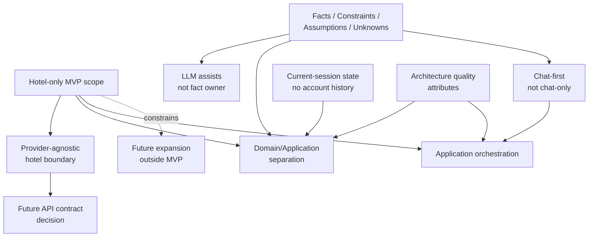

# Stage 5.8 — Architecture Decisions Draft

## Purpose

This document collects architecture decisions, decision candidates and deferred decisions for Travel Assistant MVP v1.

It is a draft-level decision inventory for Stage 5. It summarizes what Stage 5.1-5.7 already confirm, what remains intentionally deferred and which later topics may require formal ADRs.

This document is not an implementation plan, delivery backlog, API contract, database design or vendor selection. Separate ADRs may be created later in `docs/decisions/` if a decision needs durable architectural record.

## Decision Scope for MVP v1

This decision draft covers only:

- hotel-only MVP architecture boundary;
- domain/application separation;
- provider-agnostic hotel integration boundary;
- LLM/assistant boundary;
- facts/assumptions/unknowns separation;
- current-session data boundary;
- expansion-ready but scope-controlled architecture;
- architecture-level quality attributes.

This decision draft explicitly excludes:

- flight architecture decision;
- booking/payment architecture decision;
- full auth/account history decision;
- concrete provider/vendor selection;
- OpenAPI/API contract decision;
- DB/storage technology decision;
- deployment/infrastructure decision;
- production monitoring/security implementation decision.

## Confirmed Architecture Decisions

### ADR Candidate: MVP v1 remains hotel-only

**Status:** Confirmed by product/architecture scope.

**Rationale:** Stage 3/4 refocused MVP v1 on hotel search, hotel results, explanation, comparison, details and current-session shortlist. Stage 5 preserves that product boundary so architecture does not reintroduce flight, combined itinerary, booking, payments, account history or full auth.

**Consequences:**

- Domain, orchestration, integration, data and quality boundaries are designed around hotel offers only.
- Future flight/combined/booking/account topics may be referenced only as outside-MVP context.
- Any expansion beyond hotel-only requires later product decision and likely ADR.

**Out of scope:** Flight search, combined itinerary, booking flow, payments, account history, full auth, loyalty and post-booking support.

### ADR Candidate: Use provider-agnostic hotel provider boundary

**Status:** Confirmed at architecture level.

**Rationale:** Hotel facts must come from provider/source data, but product/domain concepts should not depend on a concrete provider, SDK, API payload or vendor. A provider-agnostic boundary keeps future integration replaceable and prevents provider-specific DTOs from becoming the product model.

**Consequences:**

- Hotel provider is the conceptual source of availability, price, policies, amenities, location, ratings and freshness when available.
- Provider limitations, missing data and freshness uncertainty must be represented rather than hidden.
- Future API contract work must respect the provider boundary instead of reshaping domain concepts around a provider payload.

**Deferred implementation details:** Concrete API contract, provider adapter design, method names, DTO mapping, error taxonomy, retry behavior and production hardening.

### ADR Candidate: Separate provider facts, user constraints, assistant assumptions and unknown data

**Status:** Confirmed.

**Rationale:** Stage 0-4 carryover and Stage 5 documents repeatedly require separation between user-provided constraints, provider facts, assistant assumptions and unknown data. This protects user trust, explanation quality and future implementation testability.

**Consequences:**

- User constraints must remain traceable to user input or clarification.
- Provider facts remain source-owned and override assistant assumptions.
- Assistant assumptions must be labeled and correctable.
- Unknown data must remain unknown and visible when decision-critical.
- Frontend, LLM, application and data boundaries all need to preserve the distinction.

**Deferred representation details:** Exact metadata, fields, UI labels, API payload shapes, storage representation and validation mechanisms.

### ADR Candidate: LLM assists but does not own factual hotel data

**Status:** Confirmed.

**Rationale:** The assistant may clarify, summarize, explain, compare and reason about trade-offs, but factual hotel data must come from provider/source data. LLM output cannot become the source of price, availability, policy, location, rating or amenity facts.

**Consequences:**

- LLM output must not fabricate provider facts.
- LLM assumptions must remain separate from provider facts and user-confirmed constraints.
- User corrections override assistant assumptions.
- Provider facts override assistant assumptions.
- Explanations should be grounded in user constraints and provider facts, with uncertainty visible.

**Deferred prompt/model details:** Concrete model selection, prompt templates, guardrail implementation, model routing, LLM validation method, token strategy and evaluation datasets.

### ADR Candidate: Chat-first, not chat-only architecture

**Status:** Confirmed from Stage 3/4.

**Rationale:** MVP UX uses assistant conversation as the primary guidance surface while structured results remain visible in Results View. Search Intent Summary bridges conversation and results.

**Consequences:**

- Application orchestration must coordinate assistant conversation, Search Intent Summary and Results View.
- Hotel Offer Cards remain central to comparison and shortlist.
- UX quality depends on preserving uncertainty markers and freshness limitations across conversation and structured results.
- Architecture must not collapse all guidance into chat text or treat results as unrelated static output.

**Deferred UI/API details:** Screen implementation, component props, endpoint contracts, client/server transport and direct editability of Search Intent Summary.

### ADR Candidate: Current-session state only, no account history/full auth in MVP

**Status:** Confirmed boundary, with open questions around refresh persistence.

**Rationale:** Stage 3/4 confirm save/shortlist within the current search session, while account history, full auth, persistent saved trips and cross-device sync remain outside MVP.

**Consequences:**

- Current-session shortlist is a temporary selection aid, not account storage.
- Saved/shortlisted hotel facts may become stale unless refreshed or confirmed by provider/source data.
- Architecture may consider session-level state, but must not introduce full auth, user profile, account history or permanent saved trips.

**Deferred persistence details:** Whether current-session shortlist survives page refresh, how long session context may live, storage technology, retention policy, auth model and cross-device behavior.

## Deferred Architecture Decisions

### Concrete hotel provider/API contract

**Why deferred:** The existing travel API contract has not been provided in Stage 5, and this stage must not create API/OpenAPI contracts or provider DTOs.

**Future trigger:** Existing hotel offer API contract is provided or Stage 6/API contract preparation begins.

**Likely ADR later:** Yes, if the contract affects provider boundary, data ownership, source/freshness handling or public API design.

### Concrete LLM provider/model

**Why deferred:** Stage 5 defines LLM boundaries, not vendor/model selection.

**Future trigger:** Implementation preparation needs a model access strategy or provider-specific constraints affect architecture.

**Likely ADR later:** Yes, if provider/model choice affects long-term architecture, cost, safety, privacy or operations.

### Prompt templates / guardrail implementation

**Why deferred:** Stage 5 defines conceptual LLM behavior and safety boundaries, not prompt engineering.

**Future trigger:** Implementation preparation for assistant behavior, evaluation or LLM safety controls.

**Likely ADR later:** Possibly, if prompt/guardrail strategy becomes a durable architectural boundary.

### Database/storage technology

**Why deferred:** Stage 5.6 defines conceptual data boundaries without choosing storage technology, schema, tables or persistence model.

**Future trigger:** A future stage decides session persistence, saved state, account history or production storage needs.

**Likely ADR later:** Yes, if the choice affects storage architecture, identity, retention, cross-device behavior or operational commitments.

### API/OpenAPI contracts

**Why deferred:** Stage 5 is not API contract design and must not define endpoints, payloads or OpenAPI.

**Future trigger:** Stage 6 implementation preparation or API contract stage begins after architecture consistency is reviewed.

**Likely ADR later:** Possibly, if public contracts or long-term client/server boundaries are affected.

### Deployment topology

**Why deferred:** Stage 5.7 excludes production operations, infrastructure and deployment topology.

**Future trigger:** Production readiness, environment planning or operational architecture stage.

**Likely ADR later:** Yes, if topology choices affect reliability, security, data boundaries or cost.

### Monitoring/telemetry stack

**Why deferred:** Observability is only a concept in Stage 5; exact tools, events, dashboards and retention are deferred.

**Future trigger:** MVP implementation needs quality signals or production readiness needs operational monitoring.

**Likely ADR later:** Possibly, if telemetry impacts privacy, retention, operations or provider quality review.

### Full auth/account model

**Why deferred:** Full auth and account history are outside MVP v1.

**Future trigger:** Product decision activates account history, persistent saved trips, profile, cross-device resume or authenticated personalization.

**Likely ADR later:** Yes.

### Booking/payment architecture

**Why deferred:** Booking and payments are outside MVP v1 and require transactional, compliance, reliability and security decisions.

**Future trigger:** Product decision activates booking or payment flows.

**Likely ADR later:** Yes.

### Flight/combined itinerary architecture

**Why deferred:** Flight search and combined itinerary are future expansion after hotel-only MVP and, for combined, after flight flow exists.

**Future trigger:** Product decision activates flight search or combined itinerary work.

**Likely ADR later:** Yes.

## Decision Dependency Map

Decision dependencies at conceptual level:

- Hotel-only scope constrains provider integration, domain model and orchestration.
- Facts/assumptions/unknowns separation constrains LLM, frontend and data boundaries.
- No account history/full auth constrains current-session data design.
- Provider-agnostic boundary constrains future API contract design.
- Chat-first, not chat-only constrains frontend/backend coordination.
- Architecture-level quality attributes constrain future implementation without becoming implementation backlog.

This diagram is conceptual. It is not module architecture, deployment topology, package structure, API design or implementation plan.

## ADR Candidate Table

| Decision / ADR candidate | Current status | MVP impact | Future trigger | Needs separate ADR later? |
|---|---|---|---|---|
| MVP v1 remains hotel-only | Confirmed | Defines active MVP boundary | Any proposal to add flight, combined, booking, payment, account history or full auth | Likely yes for scope-changing expansion |
| Provider-agnostic hotel provider boundary | Confirmed | Keeps hotel facts source-owned and integration replaceable | Existing API contract mapping or provider adapter design | Likely yes |
| Separate provider facts, user constraints, assistant assumptions and unknown data | Confirmed | Protects trust, explanation quality and UX clarity | API/data representation or implementation validation | Possibly |
| LLM assists but does not own factual hotel data | Confirmed | Prevents hallucinated hotel facts and unsafe capability claims | LLM provider/model/prompt implementation | Likely yes if provider/model choice is durable |
| Chat-first, not chat-only architecture | Confirmed | Requires coordinated conversation, Search Intent Summary and Results View | UI/API coordination design | Possibly |
| Current-session state only, no account history/full auth in MVP | Confirmed boundary / open refresh question | Allows shortlist without account history | Session persistence or refresh behavior decision | Possibly |
| Concrete hotel provider/API contract | Deferred | Needed for real hotel offer integration later | Existing contract provided / Stage 6 preparation | Likely yes |
| Database/storage technology | Deferred | Not needed for Stage 5 architecture draft | Persistence scope becomes concrete | Likely yes |
| Telemetry/privacy boundary | Draft / Deferred | Helps quality without overcollecting | Telemetry design becomes necessary | Possibly |
| Flight architecture | Future-only | No MVP impact except exclusion | Flight expansion activated | Yes |
| Booking/payment architecture | Future-only | No MVP impact except exclusion | Booking/payment expansion activated | Yes |
| Full auth/account history | Future-only | No MVP impact except exclusion | Account/persistent history activated | Yes |

Future-only areas are not MVP decisions.

## Open Questions from Stage 5.1-5.7

### Provider capabilities/freshness

- What minimum hotel provider capabilities are required by the existing travel API contract once it is provided?
- What minimum provider facts are required for a useful Hotel Offer Card?
- Which source/freshness markers are available from provider data and which must remain unknown until the API contract is provided?
- How should provider freshness be represented conceptually before exact provider fields are known?
- What minimum reliability behavior is expected when the hotel provider is unavailable?
- What minimum completeness is needed before hotel retrieval for broad or open destination requests?

### Search Intent Summary correction/editability

- Should Search Intent Summary be editable directly, only confirmable, or corrected through conversation in MVP?
- Should Search Intent Summary corrections be stored only in session or represented as domain event later?

### Current-session shortlist persistence

- What is the exact persistence boundary for saved/shortlisted hotels within current-session scope?
- Does current-session shortlist need persistence across browser refresh within MVP, or only active-session memory?
- How long, if at all, may current-session search context live?
- What current-session shortlist context is necessary to avoid implying account history or guaranteed fresh provider facts?

### LLM validation / assumptions visibility

- How should future domain/application boundaries represent user-provided constraints, provider facts, assistant assumptions and unknown data without prematurely defining implementation classes?
- How should LLM outputs be validated against provider facts conceptually without defining implementation mechanisms now?
- How much LLM reasoning trace should be exposed to users without overwhelming them or implying false certainty?
- How visible should assumptions and unknowns be in the UI for different decision-critical cases?
- How visible should freshness and unknown limitations be in the assistant conversation, Results View and Hotel Offer Cards?

### Telemetry/privacy

- What telemetry is acceptable for MVP quality and reliability without overengineering analytics or logging?
- What level of telemetry is acceptable for MVP?
- What telemetry is acceptable without overengineering or privacy risk?

### Reliability/provider unavailable behavior

- What provider unavailability behavior is acceptable for MVP without overengineering retry/support workflows?
- Which MVP non-functional constraints are architectural requirements, and which should remain implementation-stage acceptance criteria?
- Should any qualitative performance expectations become numeric later?

### Future security/threat model

- What future review should define security and threat-model scope?
- Which architecture decisions in Stage 5 require ADRs rather than ordinary architecture notes?

These questions are consolidated architecture inputs, not implementation tasks or backlog items.

## Future ADR Candidates

Possible future ADRs:

- ADR: Hotel provider API contract.
- ADR: LLM provider/model and prompt boundary.
- ADR: Session persistence strategy.
- ADR: Telemetry and privacy boundary.
- ADR: Authentication/account history, if future scope activates.
- ADR: Booking/payment architecture, if future scope activates.
- ADR: Flight/combined itinerary architecture, if future scope activates.

These ADRs are not created by Stage 5.8. Their detailed content should be defined only when the relevant future trigger occurs.

## Decision Guardrails

- No future feature becomes MVP without product decision and likely ADR.
- No provider facts may be invented by assistant.
- No storage, auth or account assumption should be introduced silently.
- No API/DB contracts before architecture consistency review and the appropriate future stage.
- No implementation backlog inside Stage 5 documents.
- Roadmap order must remain intact.
- Future expansion must remain clearly marked as outside MVP v1 until activated by separate decision.

## Non-goals

This document does not define:

- production implementation;
- API contracts;
- OpenAPI;
- DB schema;
- ERD;
- DTOs/classes/interfaces/enums;
- module/package structure;
- vendor/tool selection;
- deployment topology;
- monitoring/security implementation;
- implementation backlog;
- future expansion implementation.

It also does not create separate ADR files, start Stage 5.9 or start Stage 6.
