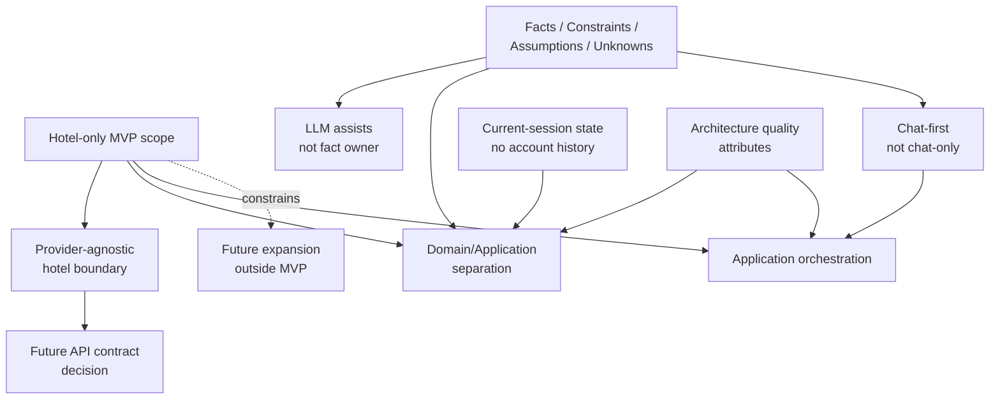

# Stage 5.8 — Architecture Decisions Draft

## Назначение

Этот документ собирает architecture decisions, decision candidates и deferred decisions для Travel Assistant MVP v1.

Это draft-level decision inventory для Stage 5. Он резюмирует, что уже подтверждено Stage 5.1-5.7, что намеренно остается deferred и какие later topics могут потребовать formal ADRs.

Этот документ не является implementation plan, delivery backlog, API contract, database design или vendor selection. Отдельные ADRs могут быть позже созданы в `docs/decisions/`, если решение требует durable architectural record.

## Статус документа

- Type: Stage 5 historical architecture artifact.
- Role: non-ADR decision inventory, draft notes и future ADR candidate list.
- Accepted ADR status: не является accepted ADR и не создает accepted ADR files.
- Backlog status: не является active backlog, task list или разрешением выполнять future decisions.
- Implementation status: не создает production code, API/OpenAPI contracts, endpoint specs, DB schema/storage model, auth/security/DevOps/testing backlog, provider adapters или implementation work.

Термин `candidate` в этом документе означает "возможный будущий ADR или future decision trigger". Термин `confirmed` означает, что соответствующий architecture guardrail подтвержден Stage 5 baseline, но не означает, что создан standalone accepted ADR.

## Scope decisions для MVP v1

Этот decision draft покрывает только:

- hotel-only MVP architecture boundary;
- domain/application separation;
- provider-agnostic hotel integration boundary;
- LLM/assistant boundary;
- facts/assumptions/unknowns separation;
- current-session data boundary;
- expansion-ready but scope-controlled architecture;
- architecture-level quality attributes.

Этот decision draft явно исключает:

- flight architecture decision;
- booking/payment architecture decision;
- full auth/account history decision;
- concrete provider/vendor selection;
- OpenAPI/API contract decision;
- DB/storage technology decision;
- deployment/infrastructure decision;
- production monitoring/security implementation decision.

## Confirmed Stage 5 architecture guardrails (non-ADR)

Следующие items являются подтвержденными architecture guardrails Stage 5 и potential future ADR candidates. Они не являются standalone accepted ADRs.

### Guardrail / future ADR candidate: MVP v1 остается hotel-only

**Status:** Confirmed by product/architecture scope.

**Rationale:** Stage 3/4 refocused MVP v1 on hotel search, hotel results, explanation, comparison, details и current-session shortlist. Stage 5 сохраняет эту product boundary, чтобы architecture не возвращала flight, combined itinerary, booking, payments, account history или full auth.

**Consequences:**

- Domain, orchestration, integration, data и quality boundaries designed around hotel offers only.
- Future flight/combined/booking/account topics могут упоминаться только как outside-MVP context.
- Любое expansion beyond hotel-only требует later product decision и, вероятно, ADR.

**Out of scope:** Flight search, combined itinerary, booking flow, payments, account history, full auth, loyalty и post-booking support.

### Guardrail / future ADR candidate: Использовать provider-agnostic hotel provider boundary

**Status:** Confirmed at architecture level.

**Rationale:** Hotel facts должны приходить из provider/source data, но product/domain concepts не должны зависеть от concrete provider, SDK, API payload или vendor. Provider-agnostic boundary сохраняет future integration replaceable и предотвращает превращение provider-specific DTOs в product model.

**Consequences:**

- Hotel provider является conceptual source of availability, price, policies, amenities, location, ratings и freshness when available.
- Provider limitations, missing data и freshness uncertainty должны represented rather than hidden.
- Future API contract work должно уважать provider boundary, а не reshape domain concepts around provider payload.

**Deferred implementation details:** Concrete API contract, provider adapter design, method names, DTO mapping, error taxonomy, retry behavior и production hardening.

### Guardrail / future ADR candidate: Разделять provider facts, user constraints, assistant assumptions и unknown data

**Status:** Confirmed.

**Rationale:** Stage 0-4 carryover и документы Stage 5 многократно требуют separation between user-provided constraints, provider facts, assistant assumptions и unknown data. Это защищает user trust, explanation quality и future implementation testability.

**Consequences:**

- User constraints должны оставаться traceable to user input or clarification.
- Provider facts остаются source-owned и override assistant assumptions.
- Assistant assumptions должны быть labeled and correctable.
- Unknown data должна оставаться unknown и visible when decision-critical.
- Frontend, LLM, application и data boundaries должны сохранять distinction.

**Deferred representation details:** Exact metadata, fields, UI labels, API payload shapes, storage representation и validation mechanisms.

### Guardrail / future ADR candidate: LLM помогает, но не владеет factual hotel data

**Status:** Confirmed.

**Rationale:** Assistant может clarify, summarize, explain, compare и reason about trade-offs, но factual hotel data должна приходить из provider/source data. LLM output не может становиться source of price, availability, policy, location, rating или amenity facts.

**Consequences:**

- LLM output не должен fabricate provider facts.
- LLM assumptions должны оставаться separate from provider facts and user-confirmed constraints.
- User corrections override assistant assumptions.
- Provider facts override assistant assumptions.
- Explanations должны быть grounded in user constraints and provider facts, with uncertainty visible.

**Deferred prompt/model details:** Concrete model selection, prompt templates, guardrail implementation, model routing, LLM validation method, token strategy и evaluation datasets.

### Guardrail / future ADR candidate: Chat-first, not chat-only architecture

**Status:** Confirmed from Stage 3/4.

**Rationale:** MVP UX использует assistant conversation как primary guidance surface, при этом structured results остаются visible в Results View. Search Intent Summary связывает conversation и results.

**Consequences:**

- Application orchestration должна coordinate assistant conversation, Search Intent Summary и Results View.
- Hotel Offer Cards остаются central to comparison and shortlist.
- UX quality зависит от сохранения uncertainty markers и freshness limitations across conversation and structured results.
- Architecture не должна collapse all guidance into chat text или treat results as unrelated static output.

**Deferred UI/API details:** Screen implementation, component props, endpoint contracts, client/server transport и direct editability of Search Intent Summary.

### Guardrail / future ADR candidate: Только current-session state, без account history/full auth в MVP

**Status:** Confirmed boundary, with open questions around refresh persistence.

**Rationale:** Stage 3/4 подтверждают save/shortlist within current search session, а account history, full auth, persistent saved trips и cross-device sync остаются outside MVP.

**Consequences:**

- Current-session shortlist — temporary selection aid, not account storage.
- Saved/shortlisted hotel facts могут стать stale unless refreshed or confirmed by provider/source data.
- Architecture может рассматривать session-level state, но не должна вводить full auth, user profile, account history или permanent saved trips.

**Deferred persistence details:** Whether current-session shortlist survives page refresh, how long session context may live, storage technology, retention policy, auth model и cross-device behavior.

## Deferred architecture decisions

### Concrete hotel provider/API contract

**Why deferred:** Existing travel API contract не был предоставлен в Stage 5, и этот этап не должен создавать API/OpenAPI contracts или provider DTOs.

**Future trigger:** Existing hotel offer API contract provided или начинается Stage 6/API contract preparation.

**Likely ADR later:** Yes, если contract влияет на provider boundary, data ownership, source/freshness handling или public API design.

### Concrete LLM provider/model

**Why deferred:** Stage 5 определяет LLM boundaries, а не vendor/model selection.

**Future trigger:** Implementation preparation требует model access strategy или provider-specific constraints affect architecture.

**Likely ADR later:** Yes, если provider/model choice влияет на long-term architecture, cost, safety, privacy или operations.

### Prompt templates / guardrail implementation

**Why deferred:** Stage 5 определяет conceptual LLM behavior и safety boundaries, а не prompt engineering.

**Future trigger:** Implementation preparation for assistant behavior, evaluation или LLM safety controls.

**Likely ADR later:** Possibly, если prompt/guardrail strategy становится durable architectural boundary.

### Database/storage technology

**Why deferred:** Stage 5.6 определяет conceptual data boundaries без выбора storage technology, schema, tables или persistence model.

**Future trigger:** Future stage решает session persistence, saved state, account history или production storage needs.

**Likely ADR later:** Yes, если choice влияет на storage architecture, identity, retention, cross-device behavior или operational commitments.

### API/OpenAPI contracts

**Why deferred:** Stage 5 не является API contract design и не должен определять endpoints, payloads или OpenAPI.

**Future trigger:** Stage 6 implementation preparation или API contract stage begins after architecture consistency is reviewed.

**Likely ADR later:** Possibly, если затрагиваются public contracts или long-term client/server boundaries.

### Deployment topology

**Why deferred:** Stage 5.7 исключает production operations, infrastructure и deployment topology.

**Future trigger:** Production readiness, environment planning или operational architecture stage.

**Likely ADR later:** Yes, если topology choices влияют на reliability, security, data boundaries или cost.

### Monitoring/telemetry stack

**Why deferred:** Observability в Stage 5 является только concept; exact tools, events, dashboards и retention deferred.

**Future trigger:** MVP implementation needs quality signals или production readiness needs operational monitoring.

**Likely ADR later:** Possibly, если telemetry влияет на privacy, retention, operations или provider quality review.

### Full auth/account model

**Why deferred:** Full auth и account history находятся outside MVP v1.

**Future trigger:** Product decision activates account history, persistent saved trips, profile, cross-device resume или authenticated personalization.

**Likely ADR later:** Yes.

### Booking/payment architecture

**Why deferred:** Booking и payments outside MVP v1 и требуют transactional, compliance, reliability и security decisions.

**Future trigger:** Product decision activates booking или payment flows.

**Likely ADR later:** Yes.

### Flight/combined itinerary architecture

**Why deferred:** Flight search и combined itinerary являются future expansion after hotel-only MVP и, для combined, после появления flight flow.

**Future trigger:** Product decision activates flight search или combined itinerary work.

**Likely ADR later:** Yes.

## Карта зависимостей decisions

Decision dependencies на conceptual level:

- Hotel-only scope constrains provider integration, domain model и orchestration.
- Facts/assumptions/unknowns separation constrains LLM, frontend и data boundaries.
- No account history/full auth constrains current-session data design.
- Provider-agnostic boundary constrains future API contract design.
- Chat-first, not chat-only constrains frontend/backend coordination.
- Architecture-level quality attributes constrain future implementation without becoming implementation backlog.

Диаграмма conceptual. Это не module architecture, deployment topology, package structure, API design или implementation plan.

## Decision inventory and future ADR candidate table

Эта таблица является inventory. Она не принимает ADR и не создает backlog.

| Decision / ADR candidate | Current status | MVP impact | Future trigger | Needs separate ADR later? |
|---|---|---|---|---|
| MVP v1 remains hotel-only | Confirmed | Defines active MVP boundary | Any proposal to add flight, combined, booking, payment, account history or full auth | Likely yes for scope-changing expansion |
| Provider-agnostic hotel provider boundary | Confirmed | Keeps hotel facts source-owned and integration replaceable | Existing API contract mapping or provider adapter design | Likely yes |
| Separate provider facts, user constraints, assistant assumptions and unknown data | Confirmed | Protects trust, explanation quality and UX clarity | API/data representation or implementation validation | Possibly |
| LLM assists but does not own factual hotel data | Confirmed | Prevents hallucinated hotel facts and unsafe capability claims | LLM provider/model/prompt implementation | Likely yes if provider/model choice is durable |
| Chat-first, not chat-only architecture | Confirmed | Requires coordinated conversation, Search Intent Summary and Results View | UI/API coordination design | Possibly |
| Current-session state only, no account history/full auth in MVP | Confirmed boundary / open refresh question | Allows shortlist without account history | Session persistence or refresh behavior decision | Possibly |
| Concrete hotel provider/API contract | Deferred | Needed for real hotel offer integration later | Existing contract provided / Stage 6 preparation | Likely yes |
| Database/storage technology | Deferred | Not needed for Stage 5 architecture draft | Persistence scope becomes concrete | Likely yes |
| Telemetry/privacy boundary | Draft / Deferred | Helps quality without overcollecting | Telemetry design becomes necessary | Possibly |
| Flight architecture | Future-only | No MVP impact except exclusion | Flight expansion activated | Yes |
| Booking/payment architecture | Future-only | No MVP impact except exclusion | Booking/payment expansion activated | Yes |
| Full auth/account history | Future-only | No MVP impact except exclusion | Account/persistent history activated | Yes |

Future-only areas are not MVP decisions.

## Open questions from Stage 5.1-5.7

### Provider capabilities/freshness

- What minimum hotel provider capabilities are required by the existing travel API contract once it is provided?
- What minimum provider facts are required for a useful Hotel Offer Card?
- Which source/freshness markers are available from provider data and which must remain unknown until the API contract is provided?
- How should provider freshness be represented conceptually before exact provider fields are known?
- What minimum reliability behavior is expected when the hotel provider is unavailable?
- What minimum completeness is needed before hotel retrieval for broad or open destination requests?

### Search Intent Summary correction/editability

- Should Search Intent Summary be editable directly, only confirmable, or corrected through conversation in MVP?
- Should Search Intent Summary corrections be stored only in session or represented as domain event later?

### Persistence current-session shortlist

- What is the exact persistence boundary for saved/shortlisted hotels within current-session scope?
- Does current-session shortlist need persistence across browser refresh within MVP, or only active-session memory?
- How long, if at all, may current-session search context live?
- What current-session shortlist context is necessary to avoid implying account history or guaranteed fresh provider facts?

### LLM validation / assumptions visibility

- How should future domain/application boundaries represent user-provided constraints, provider facts, assistant assumptions and unknown data without prematurely defining implementation classes?
- How should LLM outputs be validated against provider facts conceptually without defining implementation mechanisms now?
- How much LLM reasoning trace should be exposed to users without overwhelming them or implying false certainty?
- How visible should assumptions and unknowns be in the UI for different decision-critical cases?
- How visible should freshness and unknown limitations be in the assistant conversation, Results View and Hotel Offer Cards?

### Telemetry/privacy

- What telemetry is acceptable for MVP quality and reliability without overengineering analytics or logging?
- What level of telemetry is acceptable for MVP?
- What telemetry is acceptable without overengineering or privacy risk?

### Reliability/provider unavailable behavior

- What provider unavailability behavior is acceptable for MVP without overengineering retry/support workflows?
- Which MVP non-functional constraints are architectural requirements, and which should remain implementation-stage acceptance criteria?
- Should any qualitative performance expectations become numeric later?

### Future security/threat model

- What future review should define security and threat-model scope?
- Which architecture decisions in Stage 5 require ADRs rather than ordinary architecture notes?

Эти вопросы являются consolidated architecture inputs, а не implementation tasks или backlog items.

## Future ADR candidates / будущие кандидаты ADR

Possible future ADRs:

- ADR: Hotel provider API contract.
- ADR: LLM provider/model and prompt boundary.
- ADR: Session persistence strategy.
- ADR: Telemetry and privacy boundary.
- ADR: Authentication/account history, if future scope activates.
- ADR: Booking/payment architecture, if future scope activates.
- ADR: Flight/combined itinerary architecture, if future scope activates.

Эти ADRs не создаются Stage 5.8. Их detailed content должен определяться только при наступлении relevant future trigger.

## Decision guardrails

- No future feature becomes MVP without product decision and likely ADR.
- No provider facts may be invented by assistant.
- No storage, auth or account assumption should be introduced silently.
- No API/DB contracts before architecture consistency review and the appropriate future stage.
- No implementation backlog inside Stage 5 documents.
- Roadmap order must remain intact.
- Future expansion must remain clearly marked as outside MVP v1 until activated by separate decision.

## Non-goals / что не входит

Этот документ не определяет:

- production implementation;
- API contracts;
- OpenAPI;
- DB schema;
- ERD;
- DTOs/classes/interfaces/enums;
- module/package structure;
- vendor/tool selection;
- deployment topology;
- monitoring/security implementation;
- implementation backlog;
- future expansion implementation.

Он также не создает separate ADR files, не начинает Stage 5.9 или Stage 6.
