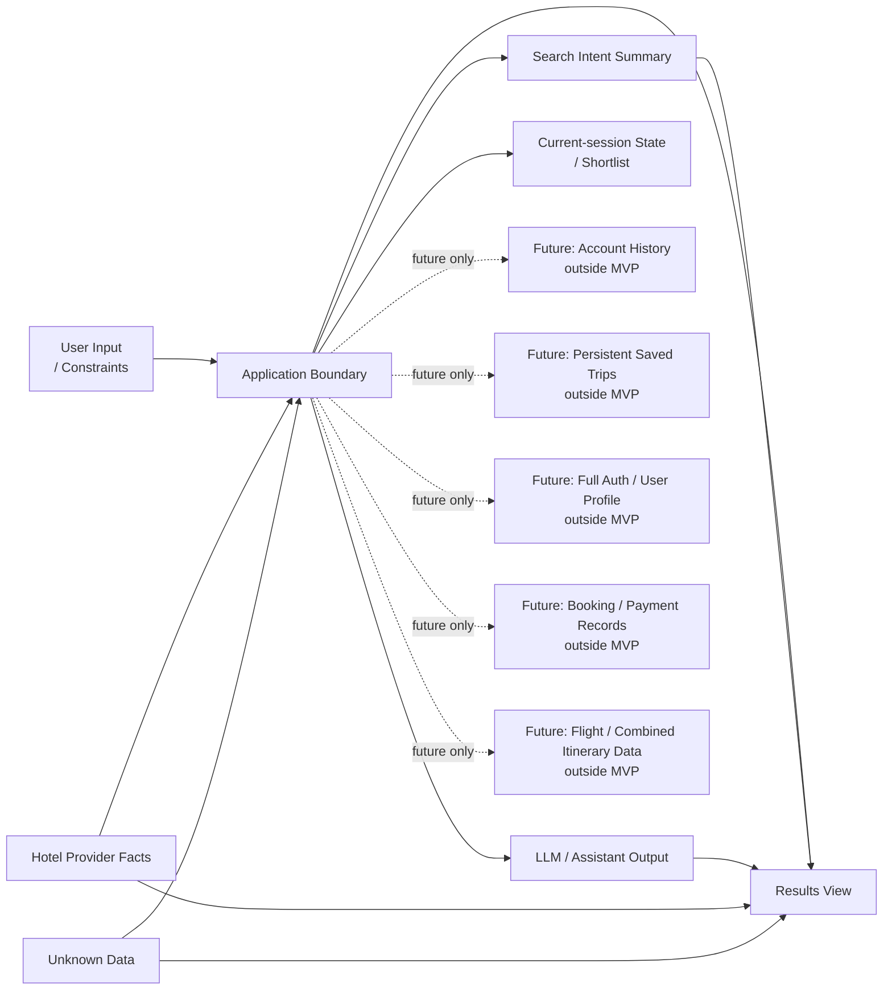

# Stage 5.6 — Data & Storage Boundaries

## Назначение

Этот документ описывает conceptual data ownership и storage boundaries для Travel Assistant MVP v1.

Он определяет data categories, ownership, volatility/persistence boundaries и constraints, которые последующая architecture и implementation preparation должны сохранять.

Этот документ не является database schema, ERD, persistence model, migration plan или implementation design.

## Data boundary scope для MVP v1

Data boundaries MVP v1 включают:

- user-provided constraints;
- Search Intent Summary;
- hotel search intent;
- provider facts;
- assistant assumptions;
- unknown data;
- hotel comparison/explanation outputs;
- current-session shortlist/search context, как подтверждено Stage 3/4;
- optional telemetry/logging как architecture consideration.

Data boundaries MVP v1 явно исключают:

- account history;
- permanent saved trips;
- full user profile;
- full authentication identity model;
- booking records;
- payment records;
- flight search data;
- combined itinerary data;
- loyalty data;
- post-booking support data.

## Data ownership principles / принципы владения данными

- User owns preferences, constraints, corrections and final decision.
- Provider/source owns hotel facts, availability, prices, policies and freshness.
- Assistant owns generated explanations, summaries, comparisons and assumptions.
- Application owns separation and traceability between data categories.
- Frontend owns presentation, not factual creation.
- Unknown data remains unknown and must not be silently filled.

## Data categories / категории данных

### User-provided constraints

Explicit travel constraints и preferences из user messages или clarifications.

Они должны оставаться traceable к user input или clarification. Они не должны заменяться assistant guesses или presented as provider-verified facts, если source data их не подтверждает.

### Search Intent Summary

Normalized, user-facing summary hotel search intent.

Он связывает conversation и results. Он не должен включать unmarked assumptions as user facts и должен сохранять visibility of missing или unknown decision-critical data.

### Hotel Search Intent

Internal conceptual intent для hotel-only retrieval.

Это не API payload, DTO, database record или storage structure.

### Provider facts

Factual hotel data из provider/source data.

Examples могут включать hotel name, location, price, availability, amenities, policies и rating. Provider facts не должны fabricated by assistant, application или frontend.

### Assistant assumptions

Inferred interpretations или trade-off judgments, generated by assistant.

Они должны быть conceptually labeled и separated from provider facts and user-provided constraints.

### Unknown data

Missing, unavailable, stale или unconfirmed data.

Unknown data должна оставаться visible, когда decision-critical, и не должна silently filled with assistant assumptions.

### Explanation / Comparison Output

Generated assistance на основе user constraints, provider facts, assistant assumptions и unknowns.

Она помогает users понимать trade-offs, но не должна становиться source of provider facts.

### Current-session Shortlist / Search Context текущей сессии

Temporary selection и search context только внутри current session.

Это не account history, permanent saved trips, cross-device sync или full-auth dependent profile data. Может включать conceptual references to selected hotel options, current Search Intent Summary, known provider facts, assumptions, unknowns и stale/freshness caveats.

### Optional telemetry / logs

Telemetry/logs являются только architecture considerations.

Они могут быть полезны для quality и failure analysis. Exact events, schemas, tools и storage deferred.

## Volatility and persistence levels

### Ephemeral conversation turn data

Может содержать immediate user message, assistant clarification и temporary interpretation context.

Owned by user for input и by assistant/application for interpretation. Conceptually входит в MVP, но этот документ не определяет, хранится ли это и как.

Не должно inferred as account history или permanent memory.

### Current-session state / состояние текущей сессии

Может содержать active Search Intent Summary, known user constraints, visible assumptions, unknown data, current hotel results, comparison candidates, stale markers и current-session shortlist.

Conceptually owned by application as session coordination state, при сохранении user/provider/assistant ownership каждой data category. Входит в MVP.

Не должно inferred as full persistence, cross-device sync, account profile или saved trips history.

### Provider-sourced data snapshot/reference

Может содержать conceptual provider facts или references, нужные для hotel results, details, comparison и current-session shortlist.

Owned by provider/source. Входит в MVP, когда hotel offers shown.

Не должно inferred as guaranteed fresh, permanent, complete или assistant-owned data.

### Generated assistant output

Может содержать summaries, explanations, comparisons, caveats и assumptions.

Owned by assistant/application как generated assistance. Входит в MVP.

Не должно inferred as provider fact, legal advice, booking confirmation, payment confirmation или guaranteed recommendation.

### Optional diagnostic telemetry

Может содержать minimal diagnostic information об unclear intent, failed searches, provider issues или LLM quality.

Owned by system for quality/reliability analysis. Это optional architecture consideration, а не Stage 5 implementation requirement.

Не должно inferred as product analytics implementation, broad personal-data collection или finalized retention policy.

### Future persistent account/history data / будущие постоянные account/history data

Может eventually включать account history, persistent saved trips, profiles, cross-device resume или authorization-linked data.

Это outside MVP v1.

Не должно inferred as current-session shortlist, MVP persistence или active implementation scope.

## Source, freshness and traceability

Provider facts conceptually могут требовать source/freshness markers. Если freshness unknown, system не должен present the data as fresh.

User constraints должны быть traceable к user input или explicit clarification.

Assistant assumptions должны быть traceable к reasoning context, но не должны exposed as hidden facts или provider-confirmed data.

Generated comparison должен distinguish provider facts, user constraints, assistant assumptions and unknowns.

Этот документ не создает concrete metadata fields.

## Boundary current-session shortlist

Stage 3/4 подтверждают current-session save/shortlist как MVP UX.

Current-session Shortlist — temporary session-level data. Он может поддерживать comparing selected hotel options during active interaction.

Он не подразумевает:

- account;
- login;
- profile;
- persistent history;
- permanent saved trips;
- cross-device sync.

Shortlisted hotel facts могут стать stale, если не refreshed или confirmed by provider/source data.

Persistence across page refresh остается open question, если позже не будет принято решение.

## Data privacy and minimization principles / принципы приватности и минимизации

На conceptual level:

- collect only what is needed for hotel search assistance;
- avoid storing unnecessary personal data;
- avoid using future account/auth assumptions in MVP;
- telemetry should avoid sensitive or excessive content where possible;
- exact privacy/legal requirements deferred to later compliance/security review if needed.

Это не legal policy и не создает security implementation.

## Data conflict and correction handling / обработка конфликтов и исправлений

- User corrections override assistant assumptions.
- Provider facts override assistant assumptions.
- Provider data freshness limitations should affect wording and confidence.
- Conflicting user constraints should be clarified.
- Unknown provider facts should not be guessed.
- Assistant-generated comparisons should be updated or relabeled after corrections.

Этот section не определяет algorithms или event handling.

## Mermaid data boundary diagram

Диаграмма conceptual. Это не ERD, и она не показывает tables, fields, schemas, IDs, indexes или database technology.

## Future data boundaries / будущие границы данных

Следующие data areas являются future-only:

- account history;
- persistent saved trips;
- user profile;
- full auth identity data;
- booking records;
- payment records;
- flight data;
- combined itinerary data;
- loyalty data;
- post-booking support data.

Они не являются частью MVP v1. Включение любого из них позже требует separate product decision и, вероятно, ADR, если решение влияет на architecture boundaries, storage, identity или public contracts.

## Open questions

- Должен ли current-session shortlist переживать page refresh в MVP?
- Какие minimal freshness/source markers нужны conceptually?
- Какая telemetry допустима без overengineering или privacy risk?
- Как долго, если вообще, может жить current-session search context?
- Должны ли Search Intent Summary corrections храниться only in session или позже represented as domain event?

Эти вопросы являются architecture-level inputs, а не implementation tasks.

## Non-goals / что не входит

Этот документ не определяет:

- DB schema;
- ERD;
- migrations;
- tables/fields/indexes;
- storage technology;
- API payloads;
- DTOs/classes/interfaces;
- retention policy;
- auth model;
- analytics event schema;
- implementation backlog;
- future account/history/booking/payment implementation.

Он также не начинает Stage 5.7 или Stage 6.
