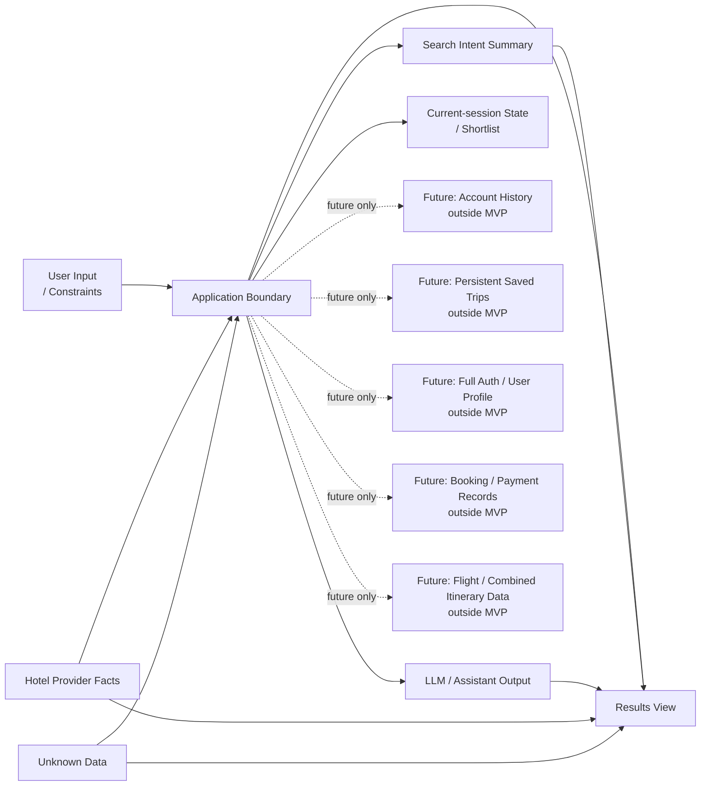

# Stage 5.6 — Data & Storage Boundaries

## Purpose

This document describes conceptual data ownership and storage boundaries for Travel Assistant MVP v1.

It defines data categories, ownership, volatility/persistence boundaries and constraints that later architecture and implementation preparation must preserve.

This document is not a database schema, ERD, persistence model, migration plan or implementation design.

## Data Boundary Scope for MVP v1

MVP v1 data boundaries include:

- user-provided constraints;
- Search Intent Summary;
- hotel search intent;
- provider facts;
- assistant assumptions;
- unknown data;
- hotel comparison/explanation outputs;
- current-session shortlist/search context, as confirmed by Stage 3/4;
- optional telemetry/logging as architecture consideration.

MVP v1 data boundaries explicitly exclude:

- account history;
- permanent saved trips;
- full user profile;
- full authentication identity model;
- booking records;
- payment records;
- flight search data;
- combined itinerary data;
- loyalty data;
- post-booking support data.

## Data Ownership Principles

- User owns preferences, constraints, corrections and final decision.
- Provider/source owns hotel facts, availability, prices, policies and freshness.
- Assistant owns generated explanations, summaries, comparisons and assumptions.
- Application owns separation and traceability between data categories.
- Frontend owns presentation, not factual creation.
- Unknown data remains unknown and must not be silently filled.

## Data Categories

### User-provided Constraints

Explicit travel constraints and preferences from user messages or clarifications.

They must remain traceable to user input or clarification. They must not be replaced by assistant guesses or presented as provider-verified facts unless source data confirms them.

### Search Intent Summary

A normalized, user-facing summary of hotel search intent.

It bridges conversation and results. It should not include unmarked assumptions as user facts and must preserve visibility of missing or unknown decision-critical data.

### Hotel Search Intent

The internal conceptual intent for hotel-only retrieval.

It is not an API payload, DTO, database record or storage structure.

### Provider Facts

Factual hotel data from provider/source data.

Examples may include hotel name, location, price, availability, amenities, policies and rating. Provider facts must not be fabricated by assistant, application or frontend.

### Assistant Assumptions

Inferred interpretations or trade-off judgments generated by the assistant.

They must be labeled conceptually and separated from provider facts and user-provided constraints.

### Unknown Data

Missing, unavailable, stale or unconfirmed data.

Unknown data must remain visible when decision-critical and must not be silently filled with assistant assumptions.

### Explanation / Comparison Output

Generated assistance based on user constraints, provider facts, assistant assumptions and unknowns.

It helps users understand trade-offs, but it must not become a source of provider facts.

### Current-session Shortlist / Search Context

Temporary selection and search context within the current session only.

It is not account history, permanent saved trips, cross-device sync or full-auth dependent profile data. It may include conceptual references to selected hotel options, current Search Intent Summary, known provider facts, assumptions, unknowns and stale/freshness caveats.

### Optional Telemetry / Logs

Telemetry/logs are architecture considerations only.

They may be useful for quality and failure analysis. Exact events, schemas, tools and storage are deferred.

## Volatility and Persistence Levels

### Ephemeral conversation turn data

May contain the immediate user message, assistant clarification and temporary interpretation context.

Owned by the user for input and by the assistant/application for interpretation. It is part of MVP conceptually, but this document does not define whether or how it is stored.

Must not be inferred as account history or permanent memory.

### Current-session state

May contain active Search Intent Summary, known user constraints, visible assumptions, unknown data, current hotel results, comparison candidates, stale markers and current-session shortlist.

Owned conceptually by the application as session coordination state, while preserving user/provider/assistant ownership of each data category. It is part of MVP.

Must not be inferred as full persistence, cross-device sync, account profile or saved trips history.

### Provider-sourced data snapshot/reference

May contain conceptual provider facts or references needed to show hotel results, details, comparison and current-session shortlist.

Owned by provider/source. It is part of MVP when hotel offers are shown.

Must not be inferred as guaranteed fresh, permanent, complete or assistant-owned data.

### Generated assistant output

May contain summaries, explanations, comparisons, caveats and assumptions.

Owned by assistant/application as generated assistance. It is part of MVP.

Must not be inferred as provider fact, legal advice, booking confirmation, payment confirmation or guaranteed recommendation.

### Optional diagnostic telemetry

May contain minimal diagnostic information about unclear intent, failed searches, provider issues or LLM quality.

Owned by the system for quality/reliability analysis. It is optional architecture consideration, not a Stage 5 implementation requirement.

Must not be inferred as product analytics implementation, broad personal-data collection or a finalized retention policy.

### Future persistent account/history data

May eventually include account history, persistent saved trips, profiles, cross-device resume or authorization-linked data.

This is outside MVP v1.

Must not be inferred as current-session shortlist, MVP persistence or active implementation scope.

## Source, Freshness and Traceability

Provider facts may need source/freshness markers conceptually. If freshness is unknown, the system must not present the data as fresh.

User constraints should be traceable to user input or explicit clarification.

Assistant assumptions should be traceable to reasoning context, but they must not be exposed as hidden facts or provider-confirmed data.

Generated comparison should distinguish provider facts, user constraints, assistant assumptions and unknowns.

This document does not create concrete metadata fields.

## Current-session Shortlist Boundary

Stage 3/4 confirm current-session save/shortlist as MVP UX.

Current-session Shortlist is temporary session-level data. It may support comparing selected hotel options during active interaction.

It does not imply:

- account;
- login;
- profile;
- persistent history;
- permanent saved trips;
- cross-device sync.

Shortlisted hotel facts may become stale unless refreshed or confirmed by provider/source data.

Persistence across page refresh remains an open question unless decided later.

## Data Privacy and Minimization Principles

At conceptual level:

- collect only what is needed for hotel search assistance;
- avoid storing unnecessary personal data;
- avoid using future account/auth assumptions in MVP;
- telemetry should avoid sensitive or excessive content where possible;
- exact privacy/legal requirements are deferred to later compliance/security review if needed.

This is not a legal policy and does not create security implementation.

## Data Conflict and Correction Handling

- User corrections override assistant assumptions.
- Provider facts override assistant assumptions.
- Provider data freshness limitations should affect wording and confidence.
- Conflicting user constraints should be clarified.
- Unknown provider facts should not be guessed.
- Assistant-generated comparisons should be updated or relabeled after corrections.

This section does not define algorithms or event handling.

## Mermaid Data Boundary Diagram

The diagram is conceptual. It is not an ERD and does not show tables, fields, schemas, IDs, indexes or database technology.

## Future Data Boundaries

The following are future-only data areas:

- account history;
- persistent saved trips;
- user profile;
- full auth identity data;
- booking records;
- payment records;
- flight data;
- combined itinerary data;
- loyalty data;
- post-booking support data.

They are not part of MVP v1. Including any of them later requires a separate product decision and likely an ADR if the decision affects architecture boundaries, storage, identity or public contracts.

## Open Questions

- Should current-session shortlist survive page refresh in MVP?
- What minimal freshness/source markers are needed conceptually?
- What telemetry is acceptable without overengineering or privacy risk?
- How long, if at all, may current-session search context live?
- Should Search Intent Summary corrections be stored only in session or represented as domain event later?

These questions are architecture-level inputs, not implementation tasks.

## Non-goals

This document does not define:

- DB schema;
- ERD;
- migrations;
- tables/fields/indexes;
- storage technology;
- API payloads;
- DTOs/classes/interfaces;
- retention policy;
- auth model;
- analytics event schema;
- implementation backlog;
- future account/history/booking/payment implementation.

It also does not start Stage 5.7 or Stage 6.
