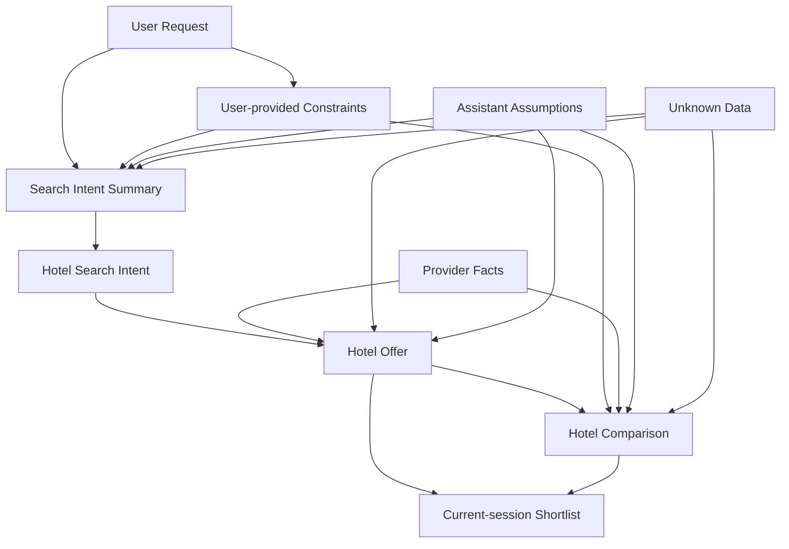

# Stage 5.3 — Domain Model & Responsibility Boundaries

## Назначение

Этот документ описывает conceptual domain model для Travel Assistant MVP v1.

Это architecture-level domain model: он называет core business concepts, их responsibilities и relationships, чтобы последующая technical work могла сохранить hotel-only MVP scope и facts / assumptions / unknowns separation из Stage 0-4.

Этот документ не определяет DTOs, database schema, API contracts, classes, interfaces, enums, package structure или module structure.

## Domain scope MVP v1 / доменный scope MVP v1

Domain MVP v1 покрывает:

- hotel-only assistant experience;
- clarification of user travel intent;
- hotel offer retrieval through provider abstraction;
- explanation and comparison of hotel options;
- results view alongside assistant conversation;
- explicit handling of facts, assumptions and unknowns.

Domain MVP v1 явно исключает:

- flights;
- combined itinerary;
- booking;
- payments;
- account history;
- full auth;
- loyalty;
- post-booking support.

Future expansion concepts могут называться для clarity of boundary, но они не являются частью MVP v1 domain model.

## Core domain concepts

### User / Traveler

Человек, который описывает travel needs, предоставляет constraints and preferences, reviews hotel options и принимает final decision.

User owns the decision. System может clarify, explain и compare, но не должен подразумевать, что assistant booked, guaranteed или finalized что-либо за пользователя.

### User Request

Initial message или серия messages от user.

Может содержать explicit constraints, preferences, trade-offs, corrections, ambiguous terms и unsupported requests. User request является source material для clarification и Search Intent Summary, а не API payload.

### User-provided constraints

Constraints, явно полученные от user, например:

- destination;
- dates или travel period;
- budget или price preference;
- guests;
- rooms;
- preferences;
- hard constraints;
- trade-offs.

User-provided constraints должны быть traceable к user input или later user clarification. System не должен добавлять как user fact то, что user не сказал или не подтвердил.

### Search Intent Summary

Normalized, human-readable representation текущего hotel search intent.

Он действует как UX/domain bridge между assistant conversation и structured results. Он должен показывать, что system understood, what is missing, what came from user input, what is an assistant assumption и what remains unknown.

Search Intent Summary должен оставаться traceable to user input and assistant clarifications. Это не API payload, DTO или persistence schema.

### Hotel Search Intent

Conceptual internal intent для retrieval hotel offers в current search.

Он представляет readiness to perform hotel-only retrieval после достаточного clarification. Он не описывает request payload shape, endpoint design, query format или implementation flow.

### Hotel Offer

Hotel option, shown to user as domain concept.

Hotel Offer может включать provider facts, missing fields и explainable highlights. Он может использоваться в results view, details, comparison и current-session shortlist. Он не должен трактоваться как database schema, provider DTO или frontend component props.

### Provider facts

Data, приходящая из provider/source data.

Examples include:

- hotel name;
- location;
- price;
- rating или review score;
- amenities;
- cancellation policy;
- availability;
- room information;
- source/freshness when available.

Provider facts должны быть separated from assistant assumptions. Provider facts override assistant assumptions when they conflict.

### Assistant assumptions

Reasoned interpretations или inferences, made by assistant.

Examples могут включать интерпретацию "cheap", "quiet", "near center", "good for family", budget tier или default room assumption. Они должны быть explicitly represented as assumptions, когда влияют на search, ranking, explanation или comparison.

Assistant assumptions cannot replace provider facts and must be correctable by the user.

### Unknown data

Data, которая недоступна из provider/source или user.

Unknown data must not be fabricated. Ее нужно представлять как unknown, not available или needing confirmation, когда это важно для decision.

Unknown data может coexist with useful Hotel Offer, но должна affect confidence, wording and comparison caveats.

### Hotel Comparison

Conceptual explanation of trade-offs between hotel offers.

Hotel Comparison может использовать provider facts, user-provided constraints и explicitly labeled assistant assumptions. Он не должен invent advantages, guarantees, availability, quietness, accessibility, policies или other hotel attributes, которые не backed by provider/source data или user-confirmed constraints.

### Current-session Shortlist / shortlist текущей сессии

Temporary selection of hotel offers или small comparison set в current search session.

Stage 3/4 подтверждают current-session save/shortlist как часть MVP UX. Это не account history, persistent profile, personal cabinet, cross-device sync или full persistence.

Current-session Shortlist должен сохранять enough conceptual context, чтобы не misrepresent old price, availability, assumptions или unknown fields as current facts.

## Responsibility boundaries

### User owns

- preferences;
- constraints;
- final decision;
- corrections to intent.

### Assistant owns

- clarification;
- summarization;
- explanation;
- comparison;
- uncertainty communication.

Assistant не owns provider facts.

### Provider owns

- factual hotel data;
- availability;
- prices;
- policies;
- source-specific data freshness.

### Application layer owns

- orchestration between user intent, assistant, provider abstraction and UI state;
- enforcing separation between facts, assumptions and unknowns;
- preserving MVP boundaries.

Это responsibility boundary, а не class/module decomposition.

### Frontend owns

- presenting conversation, Search Intent Summary, Hotel Offer Cards and Results View;
- keeping uncertainty markers visible;
- not presenting assumptions as facts.

Frontend не должен hide decision-critical unknowns или make future expansion actions look available in MVP v1.

## Facts / assumptions / unknowns model

### Provider fact

Provider fact — claim about hotel или offer, пришедший из provider/source data. Он может иметь freshness или source limitations, но не создается assistant.

Conceptual handling: показывать как fact с source/freshness context, когда available.

### User-provided constraint

User-provided constraint — requirement, preference или trade-off, stated or confirmed by user.

Conceptual handling: сохранять traceable к user input и не presenting as provider-verified, если provider/source не подтверждает.

### Assistant assumption

Assistant assumption — interpretation или inference, используемый, чтобы experience был useful, когда user не дал precise wording.

Conceptual handling: label it as assumption, make it correctable and avoid using it as hard fact.

### Unknown data

Unknown data — information, которую currently не подтверждает ни user, ни provider/source data.

Conceptual handling: keep it visible when decision-critical and avoid filling it with assistant guesses.

### Conceptual conflict handling

Когда user language, provider facts, assistant assumptions и unknown data не совпадают, system should preserve the conflict rather than collapsing it into false certainty.

Examples:

- User says "near center", but provider has only approximate location. System should describe location fit cautiously and avoid claiming verified centrality unless source data supports it.
- User asks for a "quiet hotel", but provider has no noise data. System can treat quietness as user-provided preference and unknown provider fact; it should not claim the hotel is quiet.
- Assistant infers "good for family", but provider only has amenities. System can explain the assumption using available amenities, while labeling family suitability as an interpretation.
- Price exists, but freshness is unknown. System can show provider price with freshness caveat rather than presenting it as guaranteed current price.

Этот section определяет только conceptual handling. Он не определяет algorithm, data model fields или scoring method.

## Domain relationships / доменные связи

На conceptual level:

- User Request expresses or updates User-provided Constraints.
- Assistant clarification helps form Search Intent Summary.
- Search Intent Summary supports Hotel Search Intent when required information is sufficiently understood.
- Hotel Search Intent leads to hotel-only retrieval through provider abstraction in later architecture context.
- Hotel Offer is built around Provider Facts, may expose Unknown Data and may be explained with Assistant Assumptions.
- Hotel Comparison compares Hotel Offers against User-provided Constraints using provider facts first and labeled assumptions only where needed.
- Current-session Shortlist references selected Hotel Offers within active search session and does not become account history.

Это не class diagram, database ERD, DTO map или implementation structure.

## Domain rules / доменные правила

- Hotel Offer must not include invented provider facts.
- Assistant may explain and compare, but must label assumptions.
- Unknown data must remain visible and not be silently omitted when decision-critical.
- Search Intent Summary must remain traceable to user-provided constraints and assistant clarifications.
- User corrections override assistant assumptions.
- Provider facts override assistant assumptions.
- Missing provider data should not block explanation, but must affect confidence and wording.
- MVP domain must remain hotel-only.

## Domain boundaries для future expansion

Следующие domain areas являются future-only:

- Flight Offer;
- Combined Itinerary;
- Booking;
- Payment;
- Account History;
- User Profile / Full Auth;
- Loyalty;
- Post-booking support.

Они могут быть revisited after later product decisions и, где влияют на architecture boundaries или long-term contracts, вероятно через ADRs. Этот документ не моделирует их relationships, responsibilities или data concepts как часть MVP v1.

## Open questions

- What is the exact conceptual freshness model for provider hotel data?
- What minimum provider facts are required for a useful Hotel Offer Card?
- How visible should assumptions and unknowns be in the UI for different decision-critical cases?
- Should Search Intent Summary support direct user correction in MVP, or only display understood intent while corrections happen through conversation?
- What current-session shortlist context is necessary to avoid implying account history or guaranteed fresh provider facts?

Эти вопросы являются architecture/product boundary inputs, а не implementation tasks.

## Non-goals / что не входит

Этот документ не определяет:

- DTOs;
- classes;
- interfaces;
- enums;
- API payloads;
- database tables;
- persistence model;
- endpoints;
- module/package structure;
- implementation backlog;
- future expansion implementation.

Он также не начинает Stage 5.4 или Stage 6.
