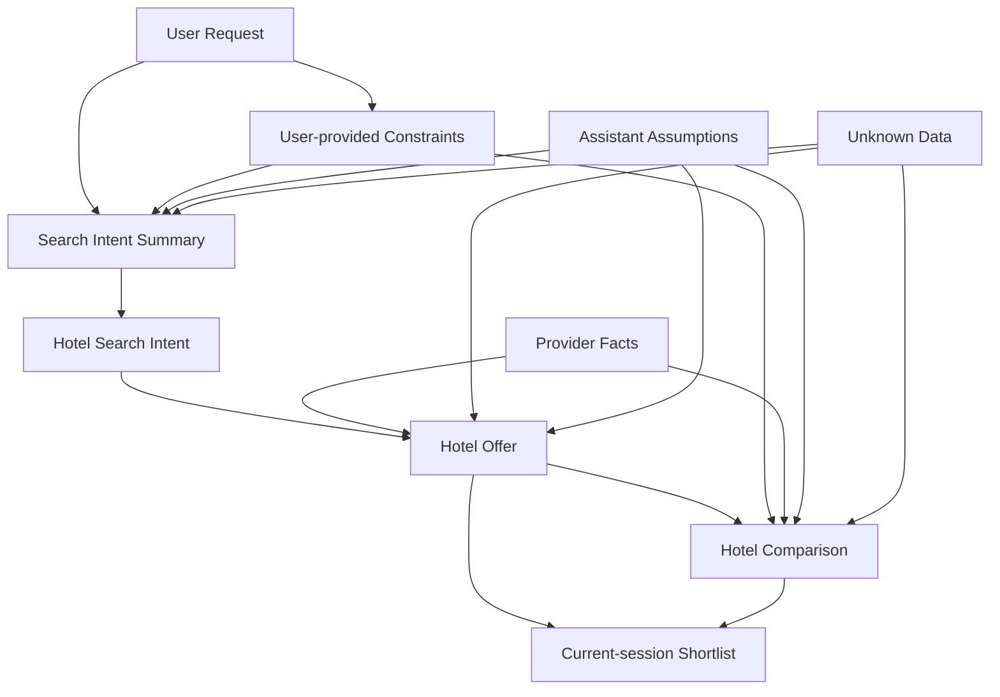

# Stage 5.3 — Domain Model & Responsibility Boundaries

## Purpose

This document describes the conceptual domain model for Travel Assistant MVP v1.

It is an architecture-level domain model: it names the core business concepts, their responsibilities and their relationships so later technical work can preserve the hotel-only MVP scope and the facts / assumptions / unknowns separation from Stage 0-4.

This document does not define DTOs, database schema, API contracts, classes, interfaces, enums, package structure or module structure.

## MVP v1 Domain Scope

The MVP v1 domain covers:

- hotel-only assistant experience;
- clarification of user travel intent;
- hotel offer retrieval through provider abstraction;
- explanation and comparison of hotel options;
- results view alongside assistant conversation;
- explicit handling of facts, assumptions and unknowns.

The MVP v1 domain explicitly excludes:

- flights;
- combined itinerary;
- booking;
- payments;
- account history;
- full auth;
- loyalty;
- post-booking support.

Future expansion concepts may be named for boundary clarity, but they are not part of the MVP v1 domain model.

## Core Domain Concepts

### User / Traveler

The person who describes travel needs, provides constraints and preferences, reviews hotel options and makes the final decision.

The user owns the decision. The system can clarify, explain and compare, but it must not imply that the assistant has booked, guaranteed or finalized anything for the user.

### User Request

The initial message or series of messages from the user.

It may contain explicit constraints, preferences, trade-offs, corrections, ambiguous terms and unsupported requests. A user request is the source material for clarification and Search Intent Summary, not an API payload.

### User-provided Constraints

Constraints explicitly received from the user, such as:

- destination;
- dates or travel period;
- budget or price preference;
- guests;
- rooms;
- preferences;
- hard constraints;
- trade-offs.

User-provided constraints must be traceable to user input or later user clarification. The system must not add as a user fact something the user did not say or confirm.

### Search Intent Summary

A normalized, human-readable representation of the current hotel search intent.

It acts as a UX/domain bridge between the assistant conversation and structured results. It should show what the system understood, what is missing, what came from user input, what is an assistant assumption and what remains unknown.

Search Intent Summary must stay traceable to user input and assistant clarifications. It is not an API payload, DTO or persistence schema.

### Hotel Search Intent

The conceptual internal intent to retrieve hotel offers for the current search.

It represents readiness to perform hotel-only retrieval after sufficient clarification. It does not describe request payload shape, endpoint design, query format or implementation flow.

### Hotel Offer

A hotel option shown to the user as a domain concept.

A Hotel Offer may include provider facts, missing fields and explainable highlights. It may be used in results view, details, comparison and current-session shortlist. It must not be treated as database schema, provider DTO or frontend component props.

### Provider Facts

Data that comes from provider/source data.

Examples include:

- hotel name;
- location;
- price;
- rating or review score;
- amenities;
- cancellation policy;
- availability;
- room information;
- source/freshness when available.

Provider facts must be separated from assistant assumptions. Provider facts override assistant assumptions when they conflict.

### Assistant Assumptions

Reasoned interpretations or inferences made by the assistant.

Examples may include interpreting "cheap", "quiet", "near center", "good for family", budget tier or default room assumption. These must be explicitly represented as assumptions when they affect search, ranking, explanation or comparison.

Assistant assumptions cannot replace provider facts and must be correctable by the user.

### Unknown Data

Data that is not available from the provider/source or the user.

Unknown data must not be fabricated. It should be represented as unknown, not available or needing confirmation when it matters to the decision.

Unknown data can coexist with a useful Hotel Offer, but it should affect confidence, wording and comparison caveats.

### Hotel Comparison

A conceptual explanation of trade-offs between hotel offers.

Hotel Comparison may use provider facts, user-provided constraints and explicitly labeled assistant assumptions. It must not invent advantages, guarantees, availability, quietness, accessibility, policies or other hotel attributes that are not backed by provider/source data or user-confirmed constraints.

### Current-session Shortlist

A temporary selection of hotel offers or a small comparison set within the current search session.

Stage 3/4 confirm current-session save/shortlist as part of MVP UX. It is not account history, a persistent profile, a personal cabinet, cross-device sync or full persistence.

Current-session Shortlist should preserve enough conceptual context to avoid misrepresenting old price, availability, assumptions or unknown fields as current facts.

## Responsibility Boundaries

### User owns

- preferences;
- constraints;
- final decision;
- corrections to intent.

### Assistant owns

- clarification;
- summarization;
- explanation;
- comparison;
- uncertainty communication.

The assistant does not own provider facts.

### Provider owns

- factual hotel data;
- availability;
- prices;
- policies;
- source-specific data freshness.

### Application layer owns

- orchestration between user intent, assistant, provider abstraction and UI state;
- enforcing separation between facts, assumptions and unknowns;
- preserving MVP boundaries.

This is a responsibility boundary, not a class/module decomposition.

### Frontend owns

- presenting conversation, Search Intent Summary, Hotel Offer Cards and Results View;
- keeping uncertainty markers visible;
- not presenting assumptions as facts.

The frontend should not hide decision-critical unknowns or make future expansion actions look available in MVP v1.

## Facts / Assumptions / Unknowns Model

### Provider fact

A provider fact is a claim about a hotel or offer that came from provider/source data. It may still have freshness or source limitations, but it is not created by the assistant.

Conceptual handling: show it as a fact with source/freshness context when available.

### User-provided constraint

A user-provided constraint is a requirement, preference or trade-off stated or confirmed by the user.

Conceptual handling: keep it traceable to user input and do not present it as provider-verified unless a provider/source confirms it.

### Assistant assumption

An assistant assumption is an interpretation or inference used to make the experience useful when the user has not provided precise wording.

Conceptual handling: label it as an assumption, make it correctable and avoid using it as a hard fact.

### Unknown data

Unknown data is information that neither the user nor provider/source data currently confirms.

Conceptual handling: keep it visible when decision-critical and avoid filling it with assistant guesses.

### Conceptual conflict handling

When user language, provider facts, assistant assumptions and unknown data do not align, the system should preserve the conflict rather than collapsing it into false certainty.

Examples:

- User says "near center", but provider has only approximate location. The system should describe location fit cautiously and avoid claiming verified centrality unless source data supports it.
- User asks for a "quiet hotel", but provider has no noise data. The system can treat quietness as a user-provided preference and unknown provider fact; it should not claim the hotel is quiet.
- Assistant infers "good for family", but provider only has amenities. The system can explain the assumption using available amenities, while labeling family suitability as an interpretation.
- Price exists, but freshness is unknown. The system can show the provider price with a freshness caveat rather than presenting it as guaranteed current price.

This section defines conceptual handling only. It does not define an algorithm, data model fields or scoring method.

## Domain Relationships

At conceptual level:

- User Request expresses or updates User-provided Constraints.
- Assistant clarification helps form Search Intent Summary.
- Search Intent Summary supports Hotel Search Intent when required information is sufficiently understood.
- Hotel Search Intent leads to hotel-only retrieval through provider abstraction in later architecture context.
- Hotel Offer is built around Provider Facts, may expose Unknown Data and may be explained with Assistant Assumptions.
- Hotel Comparison compares Hotel Offers against User-provided Constraints using provider facts first and labeled assumptions only where needed.
- Current-session Shortlist references selected Hotel Offers within the active search session and does not become account history.

This is not a class diagram, database ERD, DTO map or implementation structure.

## Domain Rules

- Hotel Offer must not include invented provider facts.
- Assistant may explain and compare, but must label assumptions.
- Unknown data must remain visible and not be silently omitted when decision-critical.
- Search Intent Summary must remain traceable to user-provided constraints and assistant clarifications.
- User corrections override assistant assumptions.
- Provider facts override assistant assumptions.
- Missing provider data should not block explanation, but must affect confidence and wording.
- MVP domain must remain hotel-only.

## Future Expansion Domain Boundaries

The following are future-only domain areas:

- Flight Offer;
- Combined Itinerary;
- Booking;
- Payment;
- Account History;
- User Profile / Full Auth;
- Loyalty;
- Post-booking support.

They may be revisited after later product decisions and, where they affect architecture boundaries or long-term contracts, likely ADRs. This document does not model their relationships, responsibilities or data concepts as part of MVP v1.

## Open Questions

- What is the exact conceptual freshness model for provider hotel data?
- What minimum provider facts are required for a useful Hotel Offer Card?
- How visible should assumptions and unknowns be in the UI for different decision-critical cases?
- Should Search Intent Summary support direct user correction in MVP, or only display understood intent while corrections happen through conversation?
- What current-session shortlist context is necessary to avoid implying account history or guaranteed fresh provider facts?

These questions are architecture/product boundary inputs, not implementation tasks.

## Non-goals

This document does not define:

- DTOs;
- classes;
- interfaces;
- enums;
- API payloads;
- database tables;
- persistence model;
- endpoints;
- module/package structure;
- implementation backlog;
- future expansion implementation.

It also does not start Stage 5.4 or Stage 6.
