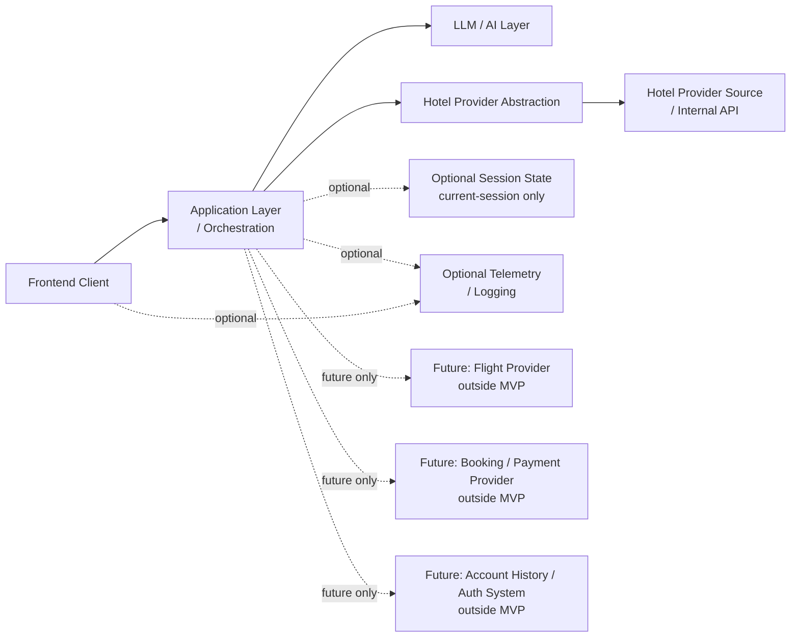

# Stage 5.5 — Integration Architecture

## Purpose

This document describes conceptual integration architecture for Travel Assistant MVP v1.

It defines boundaries between the application layer, assistant/LLM layer, hotel provider abstraction, provider source and optional infrastructure concerns. It keeps integration thinking aligned with hotel-only MVP scope and the Stage 5 facts / assumptions / unknowns separation.

This document is not an API specification, OpenAPI contract, SDK design, vendor selection or implementation plan.

## Integration Scope for MVP v1

MVP v1 integration architecture includes:

- hotel-only provider integration boundary;
- LLM / AI layer integration boundary;
- frontend/backend interaction boundary at conceptual level;
- optional telemetry/logging boundary;
- optional session-level persistence boundary if needed for current-session shortlist;
- source/freshness/unknown-data handling as an integration concern.

MVP v1 integration architecture explicitly excludes:

- flight providers;
- booking providers;
- payment providers;
- loyalty providers;
- account-history systems;
- full auth/identity providers;
- post-booking support systems;
- production-grade integration contracts.

## Integration Principles

- Provider-agnostic architecture: product and domain concepts should not depend on a specific provider.
- Facts are source-owned: hotel facts come from provider/source data, not from assistant inference.
- Assumptions are assistant-owned and must stay separate from provider facts.
- Unknown data must not be filled silently.
- Integrations must support MVP hotel-only scope.
- Future expansion must not leak into the MVP integration boundary.
- Integration design should enable replacement of providers later without changing product/domain concepts.
- Stage 5 does not introduce vendor lock-in.

## Hotel Provider Integration Boundary

The hotel provider integration boundary is the conceptual source of hotel offers and provider facts.

It may eventually connect to an internal company API. Until the existing contract is provided and handled in a later appropriate stage, Stage 5 keeps the provider boundary conceptual and provider-agnostic.

The hotel provider source may provide hotel availability, prices, policies, amenities, location, rating and related hotel facts when available. These are source-owned facts and should be treated as distinct from assistant reasoning.

The provider source may also return incomplete, unavailable or stale data. Missing and stale data must remain visible as unknown or freshness-limited, especially when decision-critical.

The hotel provider boundary does not own user intent, Search Intent Summary, assistant explanations, ranking language or user-facing assumptions.

This document does not create provider interfaces, provider method names, API payloads, OpenAPI specs, mapping tables or concrete provider choices.

## LLM / AI Integration Boundary

The LLM / AI layer may support:

- clarification;
- summarization;
- explanation;
- comparison;
- trade-off reasoning;
- uncertainty communication;
- user-facing language generation.

The LLM must not:

- fabricate provider facts;
- silently override user constraints;
- imply booking/payment/flight support in MVP;
- convert assumptions into hotel attributes;
- hide decision-critical unknown data.

LLM outputs that are assumptions must be labeled conceptually. The LLM should operate on separated inputs: user constraints, provider facts, assistant assumptions and unknowns.

This document does not choose a model, define prompt templates, create an LLM API contract or describe token/cost optimization.

## Frontend / Backend Integration Boundary

At conceptual level, the frontend presents assistant conversation, Search Intent Summary, Results View and Hotel Offer Cards.

The backend/application coordinates orchestration, provider abstraction and assistant/LLM boundary. It preserves domain rules, handles conceptual application state and keeps provider facts, user constraints, assistant assumptions and unknown data separate.

The frontend must not invent provider facts. It must preserve uncertainty markers, unknown data and freshness limitations when these affect user decisions.

Refinements and corrections flow back into the application/domain conceptually so Search Intent Summary and results context can stay aligned with user input.

This document does not describe endpoint names, request/response schemas or transport details beyond the conceptual client/server boundary.

## Source, Freshness and Confidence Boundary

Provider facts may need source/freshness indicators, depending on what the provider source returns.

Stale or unknown freshness should be represented conceptually rather than hidden. If the system cannot verify freshness, it should not imply that old price, availability or policy data is current.

Assistant confidence must not be confused with provider data freshness. A hotel can be a strong assistant match based on visible constraints while still having unknown cancellation policy, unavailable source marker or stale price data.

Decision-critical unknowns should remain visible. Exact representation is deferred to later API/domain detail stages after provider capabilities are known.

This section does not define concrete fields.

## Optional Telemetry / Logging Boundary

Telemetry and logging are architecture considerations, not Stage 5 implementation work.

They may be useful for understanding:

- failed searches;
- unclear intents;
- provider issues;
- LLM quality;
- repeated uncertainty or missing-data patterns.

Telemetry/logging must not become product analytics implementation in Stage 5. It should avoid collecting unnecessary personal data, especially free-form travel text beyond what is needed for future quality and reliability analysis.

Exact telemetry design is deferred. This document does not create event names, schemas, tools or storage requirements.

## Optional Session Persistence Boundary

Stage 3/4 confirm current-session shortlist as MVP UX, but not account history or full persistence.

Session-level persistence may be considered only to support the current session experience, such as returning to selected hotel offers, comparison candidates, Search Intent Summary, stale markers and freshness warnings.

It is not:

- account history;
- user profile;
- permanent saved trips;
- full-auth requirement;
- cross-device sync;
- booking or payment storage.

Freshness of shortlisted hotel offers is not guaranteed unless provider/source data confirms it.

This document does not create database schema, storage model or auth design.

## Integration Failure Modes at Conceptual Level

### Hotel provider unavailable

The system should represent provider unavailability as a source problem, not as proof that no hotel offers exist.

### Provider returns incomplete facts

Available facts may be shown if useful, while missing facts remain unknown and affect explanation confidence.

### Provider data freshness unknown

Unknown freshness should remain visible conceptually and should not be replaced by assistant confidence.

### LLM output conflicts with provider facts

Provider facts override assistant assumptions. The assistant output should be corrected, constrained or relabeled as an assumption.

### LLM output conflicts with user constraints

User-provided constraints and corrections override assistant assumptions. The conflict should be surfaced rather than hidden.

### Frontend cannot display all uncertainty details

Decision-critical uncertainty should remain visible. Less critical detail may be progressively disclosed, but must not disappear in a way that changes meaning.

### User changes intent after results

The application should preserve clarity about changed context and stale results. Future-scope intent changes must not silently activate flight, combined, booking or payment flows.

This section does not create retry policy, error codes, fallback implementation, incident process or support workflow.

## Mermaid Integration Diagram

The diagram is conceptual. It does not show endpoints, payloads, database tables, queues, concrete vendors, SDKs or classes.

## Future Expansion Integration Boundaries

Flights require a separate provider abstraction and product/domain decision.

Booking/payment require transactional integration boundaries and separate product/ADR decisions.

Account history/full auth require identity and persistence architecture.

Combined itinerary requires multi-domain orchestration beyond hotel-only MVP.

None of these should be prepared as MVP implementation tasks.

## Open Questions

- What minimum hotel provider capabilities are required before API contract design?
- How should provider freshness be represented conceptually before exact provider fields are known?
- Does session shortlist need refresh persistence within MVP, or only active-session memory?
- What telemetry is acceptable in MVP without overengineering analytics or logging?
- How should LLM outputs be validated against provider facts conceptually without defining implementation mechanisms now?

These questions are architecture-level inputs, not implementation tasks.

## Non-goals

This document does not define:

- OpenAPI;
- API payloads;
- endpoint design;
- provider SDK;
- concrete vendors;
- prompt templates;
- token strategy;
- database schema;
- auth design;
- payment/booking integration;
- implementation backlog.

It also does not start Stage 5.6 or Stage 6.
