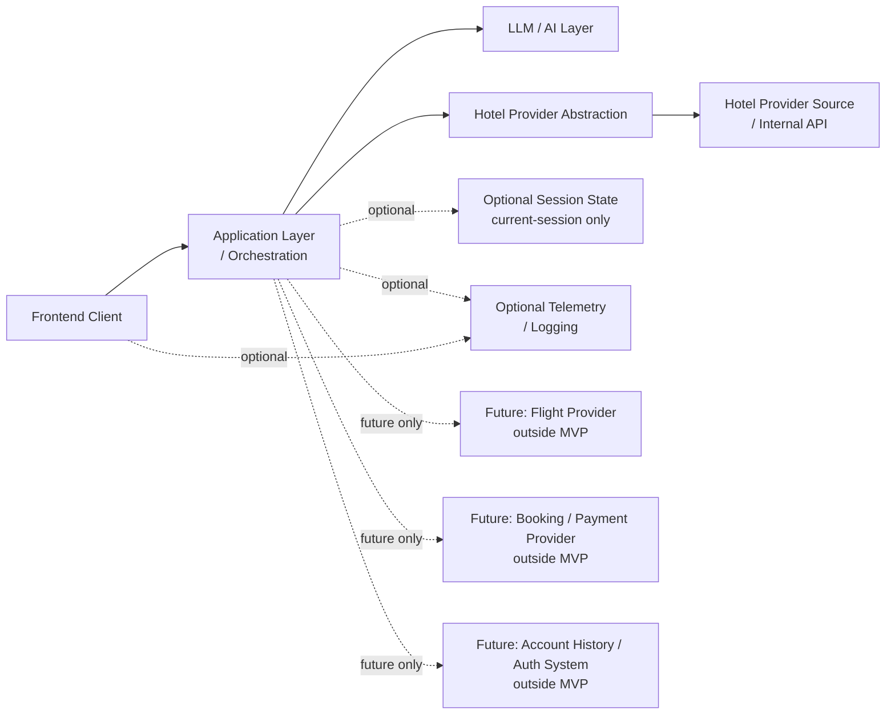

# Stage 5.5 — Integration Architecture

## Назначение

Этот документ описывает conceptual integration architecture для Travel Assistant MVP v1.

Он определяет boundaries между application layer, assistant/LLM layer, hotel provider abstraction, provider source и optional infrastructure concerns. Он сохраняет integration thinking aligned with hotel-only MVP scope и facts / assumptions / unknowns separation Stage 5.

Этот документ не является API specification, OpenAPI contract, SDK design, vendor selection или implementation plan.

## Integration scope для MVP v1

Integration architecture MVP v1 включает:

- hotel-only provider integration boundary;
- LLM / AI layer integration boundary;
- frontend/backend interaction boundary at conceptual level;
- optional telemetry/logging boundary;
- optional session-level persistence boundary, если нужна для current-session shortlist;
- source/freshness/unknown-data handling как integration concern.

Integration architecture MVP v1 явно исключает:

- flight providers;
- booking providers;
- payment providers;
- loyalty providers;
- account-history systems;
- full auth/identity providers;
- post-booking support systems;
- production-grade integration contracts.

## Integration principles / принципы интеграции

- Provider-agnostic architecture: product и domain concepts не должны зависеть от specific provider.
- Facts are source-owned: hotel facts come from provider/source data, not from assistant inference.
- Assumptions are assistant-owned и должны оставаться separate from provider facts.
- Unknown data must not be filled silently.
- Integrations должны поддерживать MVP hotel-only scope.
- Future expansion must not leak into the MVP integration boundary.
- Integration design должен позволять later replacement of providers без изменения product/domain concepts.
- Stage 5 не вводит vendor lock-in.

## Hotel provider integration boundary

Hotel provider integration boundary является conceptual source of hotel offers and provider facts.

Eventually он может подключаться к internal company API. До предоставления existing contract и его обработки на later appropriate stage Stage 5 держит provider boundary conceptual and provider-agnostic.

Hotel provider source может предоставлять hotel availability, prices, policies, amenities, location, rating и related hotel facts when available. Это source-owned facts, и они должны treated as distinct from assistant reasoning.

Provider source также может вернуть incomplete, unavailable или stale data. Missing и stale data должны оставаться visible as unknown или freshness-limited, especially when decision-critical.

Hotel provider boundary не owns user intent, Search Intent Summary, assistant explanations, ranking language или user-facing assumptions.

Этот документ не создает provider interfaces, provider method names, API payloads, OpenAPI specs, mapping tables или concrete provider choices.

## LLM / AI integration boundary

LLM / AI layer может поддерживать:

- clarification;
- summarization;
- explanation;
- comparison;
- trade-off reasoning;
- uncertainty communication;
- user-facing language generation.

LLM не должен:

- fabricate provider facts;
- silently override user constraints;
- imply booking/payment/flight support in MVP;
- convert assumptions into hotel attributes;
- hide decision-critical unknown data.

LLM outputs, которые являются assumptions, должны быть conceptually labeled. LLM должен работать с separated inputs: user constraints, provider facts, assistant assumptions и unknowns.

Этот документ не выбирает model, не определяет prompt templates, не создает LLM API contract и не описывает token/cost optimization.

## Frontend / backend integration boundary

На conceptual level frontend показывает assistant conversation, Search Intent Summary, Results View и Hotel Offer Cards.

Backend/application coordinates orchestration, provider abstraction и assistant/LLM boundary. Он сохраняет domain rules, handles conceptual application state и держит provider facts, user constraints, assistant assumptions и unknown data separated.

Frontend не должен invent provider facts. Он должен сохранять uncertainty markers, unknown data и freshness limitations, когда они влияют на user decisions.

Refinements и corrections conceptually flow back into application/domain, чтобы Search Intent Summary и results context оставались aligned with user input.

Этот документ не описывает endpoint names, request/response schemas или transport details beyond conceptual client/server boundary.

## Source, freshness and confidence boundary

Provider facts могут требовать source/freshness indicators, depending on what provider source returns.

Stale или unknown freshness should be represented conceptually rather than hidden. Если system не может verify freshness, он не должен imply that old price, availability or policy data is current.

Assistant confidence не должно смешиваться с provider data freshness. Hotel может быть strong assistant match based on visible constraints, но все еще иметь unknown cancellation policy, unavailable source marker или stale price data.

Decision-critical unknowns должны оставаться visible. Exact representation deferred to later API/domain detail stages after provider capabilities are known.

Этот section не определяет concrete fields.

## Optional telemetry / logging boundary

Telemetry и logging являются architecture considerations, а не Stage 5 implementation work.

Они могут быть useful для понимания:

- failed searches;
- unclear intents;
- provider issues;
- LLM quality;
- repeated uncertainty or missing-data patterns.

Telemetry/logging не должны становиться product analytics implementation в Stage 5. Они должны avoid collecting unnecessary personal data, especially free-form travel text beyond what is needed for future quality and reliability analysis.

Exact telemetry design deferred. Этот документ не создает event names, schemas, tools или storage requirements.

## Optional session persistence boundary

Stage 3/4 подтверждают current-session shortlist как MVP UX, но не account history или full persistence.

Session-level persistence может рассматриваться only to support current session experience, например returning to selected hotel offers, comparison candidates, Search Intent Summary, stale markers и freshness warnings.

Это не:

- account history;
- user profile;
- permanent saved trips;
- full-auth requirement;
- cross-device sync;
- booking или payment storage.

Freshness shortlisted hotel offers не guaranteed, если provider/source data не подтверждает.

Этот документ не создает database schema, storage model или auth design.

## Integration failure modes на conceptual level

### Hotel provider unavailable

System должен представлять provider unavailability как source problem, а не как proof that no hotel offers exist.

### Provider returns incomplete facts

Available facts могут быть shown if useful, while missing facts remain unknown and affect explanation confidence.

### Provider data freshness unknown

Unknown freshness должна оставаться visible conceptually и не должна заменяться assistant confidence.

### LLM output conflicts with provider facts

Provider facts override assistant assumptions. Assistant output should be corrected, constrained or relabeled as an assumption.

### LLM output conflicts with user constraints

User-provided constraints и corrections override assistant assumptions. Conflict should be surfaced rather than hidden.

### Frontend cannot display all uncertainty details

Decision-critical uncertainty должна оставаться visible. Less critical detail может быть progressively disclosed, но не должен disappear in a way that changes meaning.

### User changes intent after results

Application should preserve clarity about changed context and stale results. Future-scope intent changes must not silently activate flight, combined, booking or payment flows.

Этот section не создает retry policy, error codes, fallback implementation, incident process или support workflow.

## Mermaid integration diagram

Диаграмма conceptual. Она не показывает endpoints, payloads, database tables, queues, concrete vendors, SDKs или classes.

## Integration boundaries для future expansion

Flights require a separate provider abstraction and product/domain decision.

Booking/payment require transactional integration boundaries and separate product/ADR decisions.

Account history/full auth require identity and persistence architecture.

Combined itinerary requires multi-domain orchestration beyond hotel-only MVP.

Ничто из этого не должно быть prepared as MVP implementation tasks.

## Open questions

- Какие minimum hotel provider capabilities требуются before API contract design?
- Как conceptually представлять provider freshness до знания exact provider fields?
- Нужна ли session shortlist refresh persistence within MVP или достаточно active-session memory?
- Какая telemetry допустима в MVP без overengineering analytics или logging?
- Как conceptually валидировать LLM outputs against provider facts без определения implementation mechanisms сейчас?

Эти вопросы являются architecture-level inputs, а не implementation tasks.

## Non-goals / что не входит

Этот документ не определяет:

- OpenAPI;
- API payloads;
- endpoint design;
- provider SDK;
- concrete vendors;
- prompt templates;
- token strategy;
- database schema;
- auth design;
- payment/booking integration;
- implementation backlog.

Он также не начинает Stage 5.6 или Stage 6.
