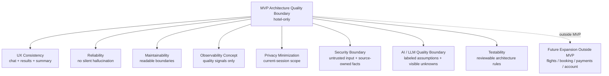

# Stage 5.7 — Non-functional Requirements / Architecture Quality Attributes

## Purpose

This document captures architecture-level non-functional requirements and quality attributes for Travel Assistant MVP v1.

It translates the hotel-only MVP product and UX baseline into quality boundaries that later architecture and implementation preparation should preserve: usability, reliability, maintainability, extensibility, observability, privacy, security, AI/LLM quality and testability.

This is not a production operations plan, DevOps backlog, monitoring setup, security policy, test plan or implementation checklist. It does not define production SLO/SLA commitments, infrastructure, deployment topology, tools, vendors or implementation tasks.

MVP v1 remains strictly hotel-only.

## NFR Scope for MVP v1

MVP v1 quality attributes include:

- usability and UX consistency from an architecture perspective;
- reliability expectations;
- performance expectations;
- maintainability;
- extensibility without scope leakage;
- observability as a concept;
- privacy and data minimization;
- security boundaries;
- AI/LLM quality and safety boundaries;
- testability at architecture level.

MVP v1 quality attributes explicitly exclude:

- production SLO/SLA commitments;
- infrastructure design;
- deployment topology;
- monitoring stack;
- security implementation;
- auth provider selection;
- payment/booking security;
- compliance/legal policy;
- implementation backlog.

## Usability and UX Consistency

Architecture must preserve the Stage 3/4 UX baseline:

- chat-first, not chat-only must remain supported architecturally;
- Results View and Assistant Conversation must stay coordinated;
- Search Intent Summary must remain visible and traceable to user input, clarifications, assumptions and unknowns;
- Hotel Offer Cards must not hide provider uncertainty, stale data or missing decision-critical facts;
- assistant explanations should be understandable, decision-oriented and grounded in visible constraints and provider facts;
- unknown and freshness limitations should be visible when decision-critical.

Usability quality is not only a frontend concern. Future application, domain, integration and data boundaries must support these distinctions so the UI can present them clearly.

## Reliability

Architecture-level reliability expectations for MVP v1:

- provider unavailability should not cause silent hallucination or invented hotel offers;
- missing hotel data should become explicit unknowns;
- LLM failures should not corrupt provider facts;
- user corrections should remain authoritative over assistant assumptions;
- provider facts should remain authoritative over assistant assumptions;
- application behavior should preserve separation between facts, assumptions and unknowns even when provider or LLM responses are partial.

This document does not define retry policy, error codes, incident flow, fallback implementation, provider uptime targets or production availability commitments.

## Performance Expectations

Hotel search and explanation should feel responsive enough for an interactive chat/results UX.

If future provider or LLM operations are long-running, the experience should communicate that state clearly rather than freezing, hiding uncertainty or implying facts that are not available yet.

Results should not conceptually require unnecessary full reload of user intent when the user refines constraints, compares hotels or returns to current-session shortlisted items.

Performance expectations must be balanced against accuracy, source ownership and uncertainty handling. A faster answer is not acceptable if it fabricates provider facts, hides unknowns or turns assistant assumptions into facts.

This document does not set numeric latency targets, caching strategies, streaming strategy, queueing design or infrastructure decisions.

## Maintainability

Architecture should remain maintainable for future coding agents and human contributors:

- domain boundaries should remain readable and hotel-focused;
- provider integration should remain provider-agnostic;
- LLM integration should remain separated from provider facts;
- data categories should remain explicit: user-provided constraints, provider facts, assistant assumptions and unknown data;
- future expansion should require explicit product decision and likely ADR when architecture boundaries change;
- architecture docs should reduce scope drift by making non-goals and outside-MVP areas hard to miss.

This document does not create module structure, package design, class boundaries, interfaces or implementation patterns.

## Extensibility Without Scope Leakage

Architecture may be expansion-ready, but MVP v1 must remain hotel-only.

Future areas such as flights, booking, payments, account history, full auth and combined itinerary may be mentioned only as outside-MVP boundaries. They must not introduce hidden MVP requirements, extra provider dependencies, data requirements, security requirements or orchestration responsibilities.

Activating any of those areas later requires a separate product decision. If the decision changes architecture boundaries, public contracts, provider strategy, identity, storage or security posture, it likely requires an ADR.

## Observability as Concept

Observability may be useful for understanding product quality and reliability risks, including:

- unclear intents;
- no-match searches;
- provider missing data;
- provider unavailable states;
- LLM/provider conflicts;
- user correction and refinement loops;
- repeated cases where unknown or stale data affects decision quality.

Telemetry/logging should help improve product quality without becoming Stage 5 implementation work.

Exact events, schemas, tools, dashboards, alerting, retention and monitoring stack are deferred.

## Privacy and Data Minimization

At architecture level:

- collect only data needed for hotel search assistance;
- avoid unnecessary personal data;
- current-session context should not imply account history, persistent saved trips or cross-device profile;
- telemetry should avoid excessive or sensitive content where possible;
- future account, auth, booking, payment or cross-device scope would require additional privacy review.

Full privacy/legal review is a future concern if product scope grows or if implementation choices introduce new data handling obligations.

This document is not a legal policy, compliance checklist or security implementation.

## Security Boundaries

Security boundaries for MVP v1 at architecture level:

- user input must not be treated as trusted system instruction;
- provider facts should remain source-owned and should not be overwritten by generated language;
- LLM output should not be trusted as factual provider data;
- assistant-generated explanations should not imply booking, payment, legal, visa, insurance or guaranteed availability outcomes;
- future auth, payment, booking and account-history security are outside MVP v1.

Exact security controls are deferred. This document does not define auth model, threat model, encryption policy, authorization rules, security tests or implementation tasks.

## AI / LLM Quality and Safety Boundaries

The assistant and LLM layer must preserve these quality boundaries:

- no fabricated provider facts;
- assumptions must be labeled;
- unknowns must remain visible;
- assistant must not imply future-scope capabilities such as flight search, combined itinerary, booking, payment or account history;
- user corrections override assistant assumptions;
- provider facts override assistant assumptions;
- explanations should be grounded in user constraints and provider facts;
- decision-critical missing data should affect wording and confidence.

This document does not create prompt templates, model routing, guardrail implementation, token strategy, evaluation dataset or LLM operations plan.

## Testability at Architecture Level

Future implementation should be able to test or review whether key architecture boundaries are preserved:

- separation between facts, assumptions and unknowns;
- hotel-only MVP scope;
- Search Intent Summary traceability to user input and clarifications;
- provider/LLM conflict handling;
- user corrections overriding assistant assumptions;
- provider facts overriding assistant assumptions;
- future expansion leakage into MVP behavior;
- decision-critical unknown/freshness visibility.

This is conceptual testability only. It does not create test cases, test framework choices, QA backlog, acceptance suite or implementation checklist.

## Mermaid Quality Boundary Diagram

The diagram is conceptual. It does not show infrastructure, deployment topology, tools, vendors, dashboards, CI/CD, runtime modules or implementation plans.

## Future NFR Boundaries

The following are future-only NFR areas:

- production SLO/SLA;
- deployment topology;
- monitoring/alerting stack;
- full security threat model;
- auth/account security;
- booking/payment compliance;
- cross-device persistence reliability;
- flight/combined itinerary scalability.

Including these areas later requires a separate future-stage decision and likely ADR if they affect architecture boundaries, contracts, infrastructure, identity, storage, security or operations.

## Open Questions

- What level of telemetry is acceptable for MVP?
- How visible should freshness and unknown limitations be in the assistant conversation, Results View and Hotel Offer Cards?
- What minimum reliability behavior is expected when the hotel provider is unavailable?
- What future review should define security and threat-model scope?
- Should any qualitative performance expectations become numeric later?

These are architecture-level questions, not implementation tasks.

## Non-goals

This document does not define:

- production SLO/SLA;
- deployment topology;
- infrastructure;
- monitoring tools;
- alerting;
- security implementation;
- auth implementation;
- compliance/legal policy;
- performance targets;
- test plan;
- implementation backlog.

It also does not start Stage 5.8 or Stage 6.
