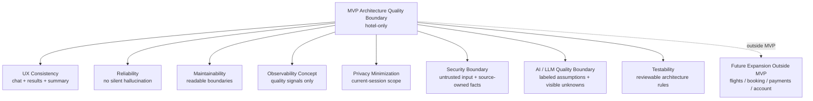

# Stage 5.7 — Non-functional Requirements / Architecture Quality Attributes

## Назначение

Этот документ фиксирует architecture-level non-functional requirements и quality attributes для Travel Assistant MVP v1.

Он переводит hotel-only MVP product и UX baseline в quality boundaries, которые последующая architecture и implementation preparation должны сохранять: usability, reliability, maintainability, extensibility, observability, privacy, security, AI/LLM quality и testability.

Это не production operations plan, DevOps backlog, monitoring setup, security policy, test plan или implementation checklist. Документ не определяет production SLO/SLA commitments, infrastructure, deployment topology, tools, vendors или implementation tasks.

MVP v1 остается строго hotel-only.

## NFR scope для MVP v1

Quality attributes MVP v1 включают:

- usability и UX consistency с архитектурной точки зрения;
- reliability expectations;
- performance expectations;
- maintainability;
- extensibility without scope leakage;
- observability as a concept;
- privacy and data minimization;
- security boundaries;
- AI/LLM quality and safety boundaries;
- testability на architecture level.

Quality attributes MVP v1 явно исключают:

- production SLO/SLA commitments;
- infrastructure design;
- deployment topology;
- monitoring stack;
- security implementation;
- auth provider selection;
- payment/booking security;
- compliance/legal policy;
- implementation backlog.

## Usability and UX consistency

Architecture должна сохранять UX baseline Stage 3/4:

- chat-first, not chat-only должен оставаться архитектурно поддержанным;
- Results View и Assistant Conversation должны оставаться coordinated;
- Search Intent Summary должен оставаться visible и traceable к user input, clarifications, assumptions и unknowns;
- Hotel Offer Cards не должны скрывать provider uncertainty, stale data или missing decision-critical facts;
- assistant explanations должны быть understandable, decision-oriented и grounded in visible constraints and provider facts;
- unknown и freshness limitations должны быть visible, когда decision-critical.

Usability quality — не только frontend concern. Будущие application, domain, integration и data boundaries должны поддерживать эти distinctions, чтобы UI мог ясно их показывать.

## Reliability

Architecture-level reliability expectations для MVP v1:

- provider unavailability не должна приводить к silent hallucination или invented hotel offers;
- missing hotel data должна становиться explicit unknowns;
- LLM failures не должны corrupt provider facts;
- user corrections должны оставаться authoritative over assistant assumptions;
- provider facts должны оставаться authoritative over assistant assumptions;
- application behavior должен сохранять separation between facts, assumptions and unknowns, даже когда provider или LLM responses partial.

Этот документ не определяет retry policy, error codes, incident flow, fallback implementation, provider uptime targets или production availability commitments.

## Performance expectations

Hotel search и explanation должны ощущаться достаточно responsive для interactive chat/results UX.

Если будущие provider или LLM operations long-running, experience должен clearly communicate that state, а не freezing, hiding uncertainty или implying facts that are not available yet.

Results conceptually не должны требовать unnecessary full reload of user intent, когда user refines constraints, compares hotels или returns to current-session shortlisted items.

Performance expectations должны балансироваться с accuracy, source ownership и uncertainty handling. Более быстрый answer неприемлем, если он fabricates provider facts, hides unknowns или turns assistant assumptions into facts.

Этот документ не задает numeric latency targets, caching strategies, streaming strategy, queueing design или infrastructure decisions.

## Maintainability

Architecture должна оставаться maintainable для future coding agents и human contributors:

- domain boundaries должны оставаться readable и hotel-focused;
- provider integration должен оставаться provider-agnostic;
- LLM integration должен оставаться separated from provider facts;
- data categories должны оставаться explicit: user-provided constraints, provider facts, assistant assumptions и unknown data;
- future expansion должен требовать explicit product decision и, вероятно, ADR при изменении architecture boundaries;
- architecture docs должны снижать scope drift, делая non-goals и outside-MVP areas трудно пропускаемыми.

Этот документ не создает module structure, package design, class boundaries, interfaces или implementation patterns.

## Extensibility without scope leakage

Architecture может быть expansion-ready, но MVP v1 должен оставаться hotel-only.

Future areas, такие как flights, booking, payments, account history, full auth и combined itinerary, могут упоминаться только как outside-MVP boundaries. Они не должны вводить hidden MVP requirements, extra provider dependencies, data requirements, security requirements или orchestration responsibilities.

Активация любой из этих areas позже требует separate product decision. Если decision меняет architecture boundaries, public contracts, provider strategy, identity, storage или security posture, вероятно требуется ADR.

## Observability as concept

Observability может быть полезна для понимания product quality и reliability risks, включая:

- unclear intents;
- no-match searches;
- provider missing data;
- provider unavailable states;
- LLM/provider conflicts;
- user correction and refinement loops;
- repeated cases where unknown or stale data affects decision quality.

Telemetry/logging должны помогать улучшать product quality, не становясь Stage 5 implementation work.

Exact events, schemas, tools, dashboards, alerting, retention и monitoring stack deferred.

## Privacy and data minimization

На architecture level:

- collect only data needed for hotel search assistance;
- avoid unnecessary personal data;
- current-session context не должен подразумевать account history, persistent saved trips или cross-device profile;
- telemetry should avoid excessive or sensitive content where possible;
- future account, auth, booking, payment или cross-device scope потребуют additional privacy review.

Full privacy/legal review — future concern, если product scope grows или implementation choices вводят new data handling obligations.

Этот документ не является legal policy, compliance checklist или security implementation.

## Security boundaries

Security boundaries для MVP v1 на architecture level:

- user input не должен treated as trusted system instruction;
- provider facts должны оставаться source-owned и не должны overwritten by generated language;
- LLM output не должен trusted as factual provider data;
- assistant-generated explanations не должны подразумевать booking, payment, legal, visa, insurance или guaranteed availability outcomes;
- future auth, payment, booking и account-history security находятся outside MVP v1.

Exact security controls deferred. Этот документ не определяет auth model, threat model, encryption policy, authorization rules, security tests или implementation tasks.

## AI / LLM quality and safety boundaries

Assistant и LLM layer должны сохранять эти quality boundaries:

- no fabricated provider facts;
- assumptions must be labeled;
- unknowns must remain visible;
- assistant must not imply future-scope capabilities such as flight search, combined itinerary, booking, payment or account history;
- user corrections override assistant assumptions;
- provider facts override assistant assumptions;
- explanations should be grounded in user constraints and provider facts;
- decision-critical missing data should affect wording and confidence.

Этот документ не создает prompt templates, model routing, guardrail implementation, token strategy, evaluation dataset или LLM operations plan.

## Testability на architecture level

Будущая implementation должна позволять test или review сохранение ключевых architecture boundaries:

- separation between facts, assumptions and unknowns;
- hotel-only MVP scope;
- Search Intent Summary traceability to user input and clarifications;
- provider/LLM conflict handling;
- user corrections overriding assistant assumptions;
- provider facts overriding assistant assumptions;
- future expansion leakage into MVP behavior;
- decision-critical unknown/freshness visibility.

Это только conceptual testability. Документ не создает test cases, test framework choices, QA backlog, acceptance suite или implementation checklist.

## Mermaid quality boundary diagram

Диаграмма conceptual. Она не показывает infrastructure, deployment topology, tools, vendors, dashboards, CI/CD, runtime modules или implementation plans.

## Future NFR boundaries / будущие границы NFR

Следующие NFR areas являются future-only:

- production SLO/SLA;
- deployment topology;
- monitoring/alerting stack;
- full security threat model;
- auth/account security;
- booking/payment compliance;
- cross-device persistence reliability;
- flight/combined itinerary scalability.

Включение этих areas позже требует separate future-stage decision и, вероятно, ADR, если они влияют на architecture boundaries, contracts, infrastructure, identity, storage, security или operations.

## Open questions

- Какой уровень telemetry допустим для MVP?
- Насколько visible должны быть freshness и unknown limitations в assistant conversation, Results View и Hotel Offer Cards?
- Какое minimum reliability behavior ожидается, когда hotel provider unavailable?
- Какой future review должен определить security и threat-model scope?
- Должны ли какие-либо qualitative performance expectations позже стать numeric?

Это architecture-level questions, а не implementation tasks.

## Non-goals / что не входит

Этот документ не определяет:

- production SLO/SLA;
- deployment topology;
- infrastructure;
- monitoring tools;
- alerting;
- security implementation;
- auth implementation;
- compliance/legal policy;
- performance targets;
- test plan;
- implementation backlog.

Он также не начинает Stage 5.8 или Stage 6.
