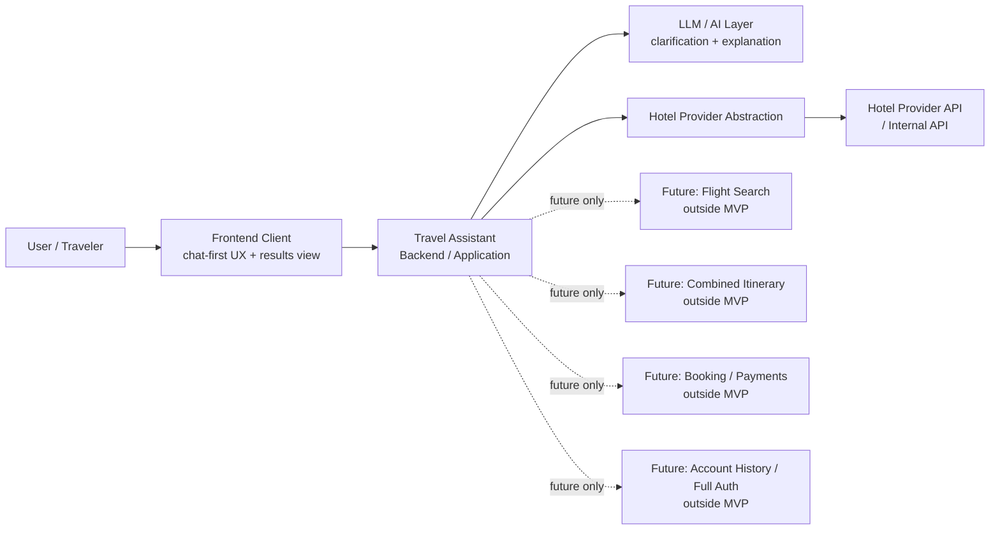

# Stage 5.2 — System Context & Boundaries

## Purpose

This document describes the system context for Travel Assistant MVP v1.

It defines external actors, system boundaries, external dependencies and explicitly out-of-scope areas for the hotel-only MVP. It translates Stage 0-4 product and UX decisions into context-level architecture boundaries without choosing implementation details.

This document is not an API specification, database design, deployment topology or implementation plan.

## MVP v1 System Context

Travel Assistant helps a user find, understand and compare hotel options through a chat-first, not chat-only UX.

The user interacts with both:

- assistant conversation for natural-language requests, clarification, explanations and comparison support;
- results view for structured hotel results, Search Intent Summary, Hotel Offer Cards, offer details, comparison and current-session shortlist.

The system may use LLM/AI capabilities for clarification, reasoning, explanation, comparison and summarization. LLM/AI output supports the user experience, but it is not the source of truth for hotel facts.

The system must keep these data categories separate:

- user-provided constraints;
- provider facts;
- assistant assumptions;
- unknown data.

The system must not fabricate provider facts. Prices, availability, hotel attributes, ratings, amenities, policies, source/freshness and similar hotel facts must come from provider/source data when shown as facts.

## Primary Actors

### User / Traveler

The person planning a hotel stay. The user provides trip constraints, preferences and clarifications, reviews results, asks for comparisons and may save or shortlist hotel offers within the current search session.

### Travel Assistant System

The overall product boundary that coordinates the conversation experience, structured results, hotel-only search flow, explanation and comparison support. It is responsible for preserving MVP boundaries and separating user input, provider facts, assistant assumptions and unknown data.

### Assistant / LLM layer

The AI-assisted reasoning layer used for intent clarification, summarization, explanation and comparison language. It may transform and explain information, but it must not silently create factual hotel attributes or replace provider data.

### Hotel Offer Provider abstraction

The conceptual boundary between Travel Assistant and hotel offer sources. It represents hotel-only offer retrieval for MVP v1 without exposing provider-specific contracts, DTOs or vendor details inside product/domain concepts.

### Frontend client

The user-facing client surface for the assistant conversation and results view. It presents the chat-first workflow, Search Intent Summary, Hotel Offer Cards, offer details, comparison states and current-session save/shortlist affordances.

### Backend / application layer

The system coordination layer that owns application flow at a conceptual level: clarifying hotel intent, preserving session context, requesting hotel offers through provider abstraction and preparing data for explanation and results presentation.

These actor descriptions do not define concrete classes, endpoints, modules, database tables or framework structure.

## External Systems and Dependencies

### Hotel provider API / internal company API

The future integration target for real hotel offer facts in MVP v1. It is treated as an external source behind a hotel provider abstraction until its existing contract is provided and addressed in the appropriate architecture/API stage.

Stage 5.2 does not define real integration contracts, endpoint shapes, DTO mappings or provider-specific error models.

### LLM provider / model gateway

The external or internal model access layer that may support clarification, reasoning, comparison and explanation. No concrete vendor, model, SDK or prompt contract is selected here.

### Optional analytics / logging

Analytics and logging may become architecture considerations for observability, quality review and product learning. They are not defined as MVP implementation requirements in this document.

### Optional persistence layer

Persistence may become an architecture consideration for session continuity, saved/shortlisted hotels or future account history. Stage 5.2 only recognizes the boundary question; it does not define database schema, storage technology or persistence behavior.

Payment providers, booking providers and flight providers are not MVP v1 dependencies.

## System Boundary — Inside MVP v1

The following are inside the MVP v1 system boundary at context level:

- hotel search intent clarification;
- hotel-only offer retrieval through provider abstraction;
- hotel result presentation;
- Search Intent Summary;
- Hotel Offer Card;
- assistant explanations and comparisons;
- explicit handling of assistant assumptions and unknown data;
- basic save/shortlist within the current search session, as already defined in Stage 3/4 product docs, without account history, cross-device sync or full authentication.

Inside the boundary does not mean implementation is started. These are product/system responsibilities that later architecture documents may refine without creating production code in Stage 5.

## System Boundary — Outside MVP v1

The following are outside MVP v1:

- flight search;
- combined itinerary;
- booking flow;
- payments;
- account history;
- full authentication;
- loyalty programs;
- production provider integration;
- real ticketing;
- support operations;
- admin panel;
- post-booking management.

These areas may be mentioned only as future expansion context. They are not MVP components and must not be treated as hidden current requirements.

## Boundary Rules

- Provider facts come only from provider/source data.
- Assistant assumptions must be labeled as assumptions.
- Unknown data must remain unknown.
- User constraints must be traceable to user input.
- LLM may transform, summarize, compare and explain, but must not silently create factual hotel attributes.
- Future features may be referenced only as external or future systems, not as MVP components.

## Context Diagram

The diagram is context-level only. It does not show endpoints, tables, classes, queues, deployment topology or step-by-step runtime behavior.

## Data Flow at Context Level

At a conceptual level:

1. User provides travel constraints and preferences for a hotel stay.
2. Assistant clarifies intent and missing required information when needed.
3. System forms a Search Intent Summary that separates known fields, user-provided constraints, assumptions and unknowns.
4. Provider abstraction retrieves hotel offers from hotel provider/source data.
5. System preserves the distinction between provider facts, assistant assumptions and unknown data.
6. User sees assistant explanation together with structured results view, including Hotel Offer Cards, details, comparison support and current-session save/shortlist where applicable.

This is not a backend sequence diagram, API payload design or implementation plan.

## Future Expansion Boundaries

Flights may become a future external system and integration area after hotel flow.

Combined itinerary may become a future orchestration concern after the relevant hotel and flight flows are separately established.

Booking and payment may become future transactional subsystems with separate product, architecture, compliance and reliability decisions.

Account history and full authentication may become future identity and persistence scope.

None of these are MVP v1 system components.

## Open Questions

- What is the exact persistence boundary for saved/shortlisted hotels within current-session scope?
- What minimum hotel provider capabilities are needed before the existing API contract can be mapped safely?
- How much LLM reasoning trace should be exposed to users without overwhelming them or implying false certainty?
- What telemetry is acceptable for MVP quality and reliability without overengineering analytics or logging?
- Which source/freshness markers are available from provider data and which must remain unknown until the API contract is provided?

These questions are architectural inputs for later Stage 5 documents, not implementation tasks.

## Non-goals

This document does not define:

- API contracts;
- database schema;
- deployment topology;
- production provider integration;
- implementation backlog;
- concrete framework/module structure.

It also does not start Stage 5.3 or Stage 6.
