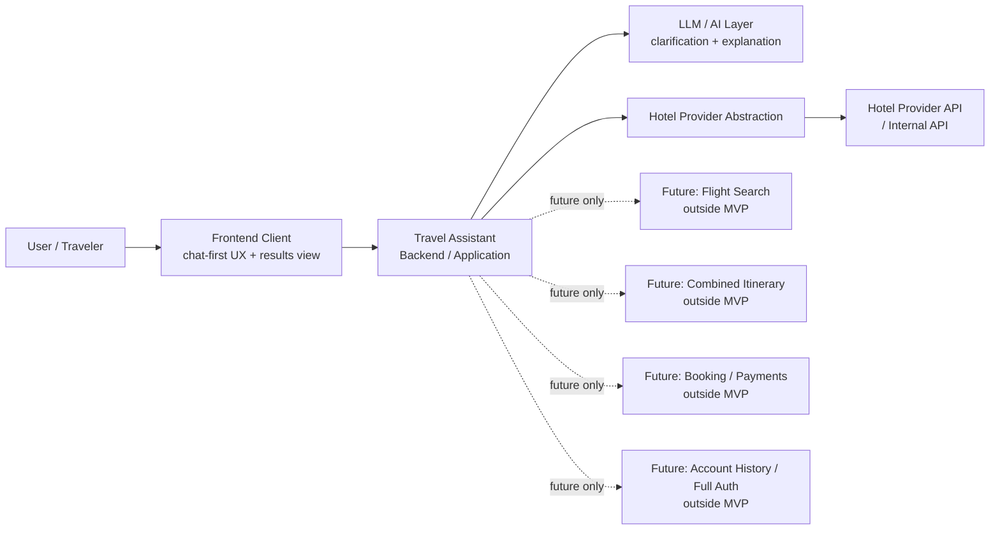

# Stage 5.2 — System Context & Boundaries

## Назначение

Этот документ описывает system context для Travel Assistant MVP v1.

Он определяет external actors, system boundaries, external dependencies и явно out-of-scope areas для hotel-only MVP. Он переводит product и UX decisions Stage 0-4 в context-level architecture boundaries без выбора implementation details.

Этот документ не является API specification, database design, deployment topology или implementation plan.

## System context MVP v1

Travel Assistant помогает пользователю находить, понимать и сравнивать hotel options через chat-first, not chat-only UX.

Пользователь взаимодействует с двумя поверхностями:

- assistant conversation для natural-language requests, clarification, explanations и comparison support;
- results view для structured hotel results, Search Intent Summary, Hotel Offer Cards, offer details, comparison и current-session shortlist.

Система может использовать LLM/AI capabilities для clarification, reasoning, explanation, comparison и summarization. LLM/AI output поддерживает user experience, но не является source of truth для hotel facts.

Система должна держать эти data categories разделенными:

- user-provided constraints;
- provider facts;
- assistant assumptions;
- unknown data.

Система не должна fabricate provider facts. Prices, availability, hotel attributes, ratings, amenities, policies, source/freshness и похожие hotel facts должны приходить из provider/source data, когда они показываются как facts.

## Primary actors

### User / Traveler

Человек, планирующий hotel stay. Пользователь предоставляет trip constraints, preferences и clarifications, просматривает results, просит comparisons и может save или shortlist hotel offers в рамках current search session.

### Travel Assistant System

Общая product boundary, которая координирует conversation experience, structured results, hotel-only search flow, explanation и comparison support. Она отвечает за сохранение MVP boundaries и разделение user input, provider facts, assistant assumptions и unknown data.

### Assistant / LLM layer

AI-assisted reasoning layer, используемый для intent clarification, summarization, explanation и comparison language. Он может transform и explain information, но не должен silently create factual hotel attributes или replace provider data.

### Hotel Offer Provider abstraction

Концептуальная boundary между Travel Assistant и hotel offer sources. Она представляет hotel-only offer retrieval для MVP v1 без раскрытия provider-specific contracts, DTOs или vendor details внутри product/domain concepts.

### Frontend client

User-facing client surface для assistant conversation и results view. Он показывает chat-first workflow, Search Intent Summary, Hotel Offer Cards, offer details, comparison states и current-session save/shortlist affordances.

### Backend / application layer

System coordination layer, который conceptually owns application flow: clarifying hotel intent, preserving session context, requesting hotel offers through provider abstraction и preparing data for explanation and results presentation.

Эти descriptions actors не определяют concrete classes, endpoints, modules, database tables или framework structure.

## External systems and dependencies

### Hotel provider API / internal company API

Future integration target для real hotel offer facts в MVP v1. Он рассматривается как external source за hotel provider abstraction до тех пор, пока его existing contract не будет предоставлен и разобран на соответствующем architecture/API stage.

Stage 5.2 не определяет real integration contracts, endpoint shapes, DTO mappings или provider-specific error models.

### LLM provider / model gateway

External или internal model access layer, который может поддерживать clarification, reasoning, comparison и explanation. Конкретный vendor, model, SDK или prompt contract здесь не выбирается.

### Optional analytics / logging

Analytics и logging могут стать architecture considerations для observability, quality review и product learning. В этом документе они не определяются как MVP implementation requirements.

### Optional persistence layer

Persistence может стать architecture consideration для session continuity, saved/shortlisted hotels или future account history. Stage 5.2 только признает boundary question; он не определяет database schema, storage technology или persistence behavior.

Payment providers, booking providers и flight providers не являются MVP v1 dependencies.

## System boundary — inside MVP v1

Следующее находится внутри MVP v1 system boundary на context level:

- hotel search intent clarification;
- hotel-only offer retrieval through provider abstraction;
- hotel result presentation;
- Search Intent Summary;
- Hotel Offer Card;
- assistant explanations and comparisons;
- explicit handling of assistant assumptions and unknown data;
- basic save/shortlist в current search session, как уже определено в Stage 3/4 product docs, без account history, cross-device sync или full authentication.

Inside the boundary не означает, что implementation начата. Это product/system responsibilities, которые последующие architecture documents могут уточнять без создания production code в Stage 5.

## System boundary — outside MVP v1

Следующее находится вне MVP v1:

- flight search;
- combined itinerary;
- booking flow;
- payments;
- account history;
- full authentication;
- loyalty programs;
- production provider integration;
- real ticketing;
- support operations;
- admin panel;
- post-booking management.

Эти areas могут упоминаться только как future expansion context. Они не являются MVP components и не должны трактоваться как hidden current requirements.

## Boundary rules

- Provider facts приходят только из provider/source data.
- Assistant assumptions должны быть labeled as assumptions.
- Unknown data должна оставаться unknown.
- User constraints должны трассироваться к user input.
- LLM может transform, summarize, compare и explain, но не должен silently create factual hotel attributes.
- Future features могут упоминаться только как external или future systems, а не как MVP components.

## Context diagram

Диаграмма только context-level. Она не показывает endpoints, tables, classes, queues, deployment topology или step-by-step runtime behavior.

## Data flow на context level / поток данных на уровне контекста

На conceptual level:

1. User provides travel constraints and preferences for a hotel stay.
2. Assistant clarifies intent and missing required information when needed.
3. System forms a Search Intent Summary that separates known fields, user-provided constraints, assumptions and unknowns.
4. Provider abstraction retrieves hotel offers from hotel provider/source data.
5. System preserves the distinction between provider facts, assistant assumptions and unknown data.
6. User sees assistant explanation together with structured results view, including Hotel Offer Cards, details, comparison support and current-session save/shortlist where applicable.

Это не backend sequence diagram, API payload design или implementation plan.

## Boundaries future expansion

Flights могут стать future external system и integration area после hotel flow.

Combined itinerary может стать future orchestration concern после отдельной стабилизации relevant hotel and flight flows.

Booking и payment могут стать future transactional subsystems с отдельными product, architecture, compliance и reliability decisions.

Account history и full authentication могут стать future identity and persistence scope.

Ничто из этого не является MVP v1 system components.

## Open questions

- Какова exact persistence boundary для saved/shortlisted hotels внутри current-session scope?
- Какие minimum hotel provider capabilities нужны до safe mapping existing API contract?
- Какой объем LLM reasoning trace следует раскрывать пользователям, не перегружая их и не подразумевая false certainty?
- Какая telemetry допустима для MVP quality и reliability без overengineering analytics или logging?
- Какие source/freshness markers доступны из provider data, а какие должны оставаться unknown до предоставления API contract?

Эти вопросы являются architectural inputs для последующих Stage 5 documents, а не implementation tasks.

## Non-goals / что не входит

Этот документ не определяет:

- API contracts;
- database schema;
- deployment topology;
- production provider integration;
- implementation backlog;
- concrete framework/module structure.

Он также не начинает Stage 5.3 или Stage 6.
